# AI-Driven Documentation Automation

> **Purpose**: Guide for understanding the project's AI-driven documentation ecosystem
>
> **Audience**: Developers who want to learn this pattern and apply it to their own projects
>
> **Last Updated**: 2026-01-30

---

## The Paradigm: AI as Compiler, Prompt as Program

If we view **AI as a compiler/interpreter**, then the prompts and documentation architecture become a **programming language and program**. This project implements a complete "AI program" with its own syntax, runtime, and execution model.

### The Compilation Analogy

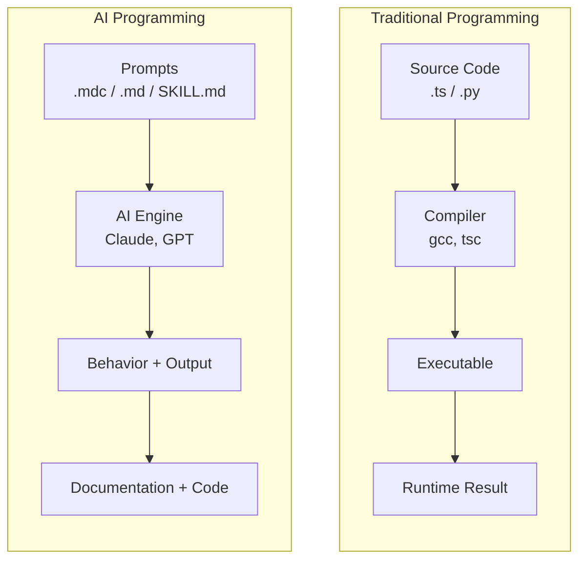

### Language Components Mapping

| Traditional Programming | AI Programming (This Project) | Location |
| ----------------------- | ----------------------------- | -------- |
| **Language Syntax** | Markdown + YAML frontmatter format | `.mdc`, `.md` |
| **Entry Point** (`main()`) | Rules with `alwaysApply: true` | `.cursor/rules/` |
| **Function Definitions** | Commands (user-invoked prompts) | `.cursor/commands/` |
| **Libraries/Modules** | Skills (reusable knowledge) | `.cursor/skills/`, `.claude/skills/` |
| **Import/Require** | `@see`, `@link`, file references | Within prompts |
| **Runtime Environment** | Documentation context (indexes, manifests) | `docs-site/` |
| **Memory/Heap** | AI context window + stored reports | `ai-reports/` |
| **Type System** | TSDoc annotations + JSON schemas | TSDoc tags, `manifest.json` |
| **Build Artifacts** | Generated documentation | `api-reference/` |
| **Persistent Storage** | Structure indexes, AI reports | `*-structure.md`, `ai-reports/` |

---

## Program Architecture

### The "AI Program" Stack

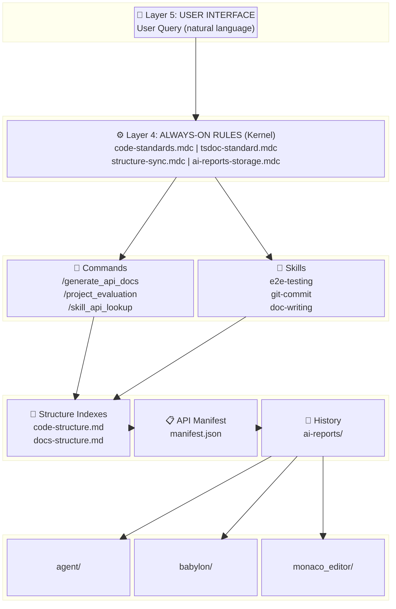

**Layer Details:**

| Layer | Name | Components | Purpose |
| ----- | ---- | ---------- | ------- |
| 5 | User Interface | Natural language query | Entry point |
| 4 | Kernel Rules | `alwaysApply: true` rules | Behavioral constraints |
| 3 | On-Demand Modules | Commands + Skills | Task-specific knowledge |
| 2 | Runtime Context | Indexes + Manifest + Reports | Navigation & memory |
| 1 | Source Code | TypeScript with TSDoc | The actual codebase |

### Execution Model

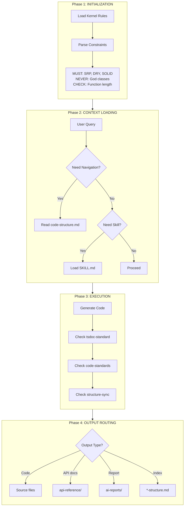

**Execution Phases:**

| Phase | Name | Actions |
| ----- | ---- | ------- |
| 1 | Initialization | Load `alwaysApply: true` rules, parse constraints |
| 2 | Context Loading | Lazy-load structure indexes, skills as needed |
| 3 | Execution | Generate output while checking all rule constraints |
| 4 | Output Routing | Route outputs to correct destinations |

---

## Language Specification

### Syntax: Rule Definition Language

Rules are the "kernel modules" of this AI program. They use a strict format:

**File structure:** `.cursor/rules/example-rule.mdc`

````yaml
---
description: Brief description (appears in AI context)
globs:                           # Scope control (like #ifdef)
  - "**/*.ts"
  - "**/*.tsx"
alwaysApply: true                # true = kernel, false = optional
---

# Rule Title (H1 = entry point)

## Trigger Conditions (when to activate)

| Condition | Action |
| --------- | ------ |
| X happens | Do Y   |

## Constraints (behavioral boundaries)

**[CONSTRAINTS]**
- MUST: Required behaviors (like assertions)
- NEVER: Forbidden behaviors (like type errors)
- CHECK: Validation requirements
**[/CONSTRAINTS]**

## Examples (training data)

**[EXAMPLE: good]**
✅ Correct behavior demonstration
**[/EXAMPLE]**

**[EXAMPLE: bad]**
❌ Incorrect behavior to avoid
**[/EXAMPLE]**
````

### Syntax: Command Definition Language

Commands are "functions" that users invoke explicitly:

**File structure:** `.cursor/commands/example-command.md`

````markdown
# Command Name

> Scope: When this command applies
> Goal: What this command achieves

---

## Role (function signature + docstring)

You are [role description with capabilities]

**[ROLE-PRINCIPLES]**
- Principle 1 (like function preconditions)
- Principle 2
**[/ROLE-PRINCIPLES]**

---

## Input (parameters)

**[ENV]**
Project: ${project_name}      # Injected variables
Date: ${date}
**[/ENV]**

**[USER-INPUT]**
${user_query}                  # User's actual request
**[/USER-INPUT]**

---

## Process (function body)

### Phase 1: [Step Name]
**[TASKS]**
- Task 1
- Task 2
**[/TASKS]**

### Phase 2: [Step Name]
...

---

## Output Format (return type)

**[OUTPUT-TEMPLATE]**
# Output Structure
...
**[/OUTPUT-TEMPLATE]**

---

## Constraints (assertions + error handling)

**[CONSTRAINTS]**
- MUST: ...
- NEVER: ...
**[/CONSTRAINTS]**
````

### Syntax: Skill Definition Language

Skills are "libraries" providing domain knowledge:

**File structure:** `.cursor/skills/example-skill/SKILL.md`

````markdown
# Skill Name

Brief description (like library README)

## When to Use (import conditions)

Use this skill when:
- Condition A
- Condition B

## Prerequisites (dependencies)

- Dependency 1
- Dependency 2

## Core Concepts (API documentation)

### Concept 1
Explanation...

### Concept 2
Explanation...

## Patterns (code examples)

### Pattern: [Name]
```
Example implementation
```

## Anti-Patterns (what not to do)

### Anti-Pattern: [Name]
❌ Why this is wrong...
````

---

## Module System

### Import/Export Model

**Implicit Imports (Always Available):**

| Module | Status |
| ------ | ------ |
| `code-standards.mdc` | ✅ Auto-loaded |
| `tsdoc-standard.mdc` | ✅ Auto-loaded |
| `structure-sync.mdc` | ✅ Auto-loaded |
| `ai-reports-storage.mdc` | ✅ Auto-loaded |

**Explicit Imports (On-Demand):**

| Method | Trigger | Example |
| ------ | ------- | ------- |
| User Command | `/command_name` | `/generate_api_docs` → loads `generate_api_docs.md` |
| Contextual Loading | Task detection | "Write E2E test" → loads `e2e-testing/SKILL.md` |
| Cross-Reference | `@see`, `@link` | "See tsdoc-standard.md" → AI follows link |

**Module Exports:**

| Module Type | Exports |
| ----------- | ------- |
| Rule | Constraints, triggers, behaviors |
| Command | Workflow, output format, execution steps |
| Skill | Domain knowledge, patterns, anti-patterns |
| Structure Index | Navigation paths, location mappings |
| Manifest | API definitions, type information |

### Dependency Graph

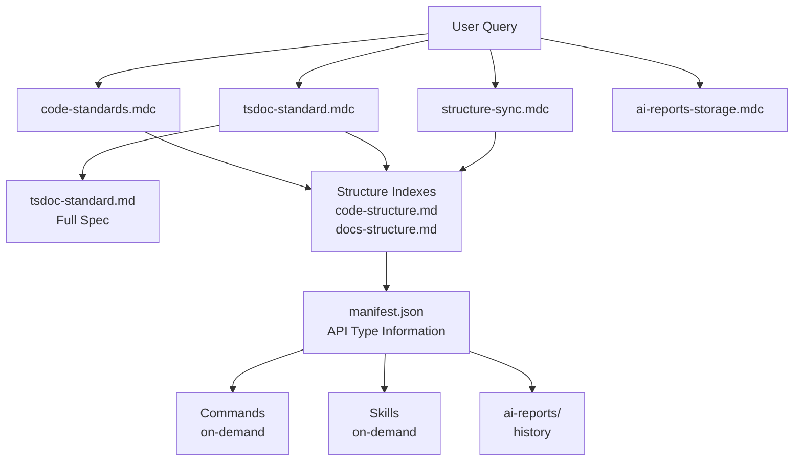

---

## Type System

### TSDoc as Type Annotations

In this AI program, TSDoc comments serve as **type annotations** that the AI uses to understand APIs:

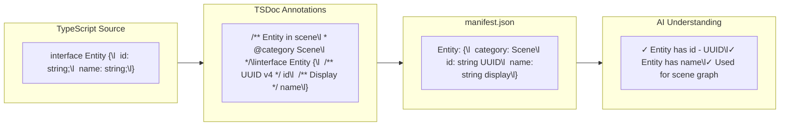

**Type Information Flow:**

| Stage | Format | Purpose |
| ----- | ------ | ------- |
| Source Code | TypeScript types | Compile-time type safety |
| TSDoc Comments | Structured annotations | Human + AI readable |
| manifest.json | JSON index | AI retrieval |
| AI Understanding | Natural language | Code generation context |

### Category as Namespace

The `@category` tag functions like a **namespace** in traditional programming:

| @category | Namespace Purpose | Contains |
| --------- | ----------------- | -------- |
| `Entity` | Scene graph nodes | EntityData, createEntity, deleteEntity |
| `Component` | Entity attachments | ComponentData, addComponent, removeComponent |
| `Asset` | Project resources | AssetData, importAsset, listAssets |
| `Scene` | Scene management | SceneData, saveScene, loadScene |
| `Tools` | AI tool definitions | babylon_create_entity, babylon_get_scene |

---

## Memory Model

### Context Window as RAM

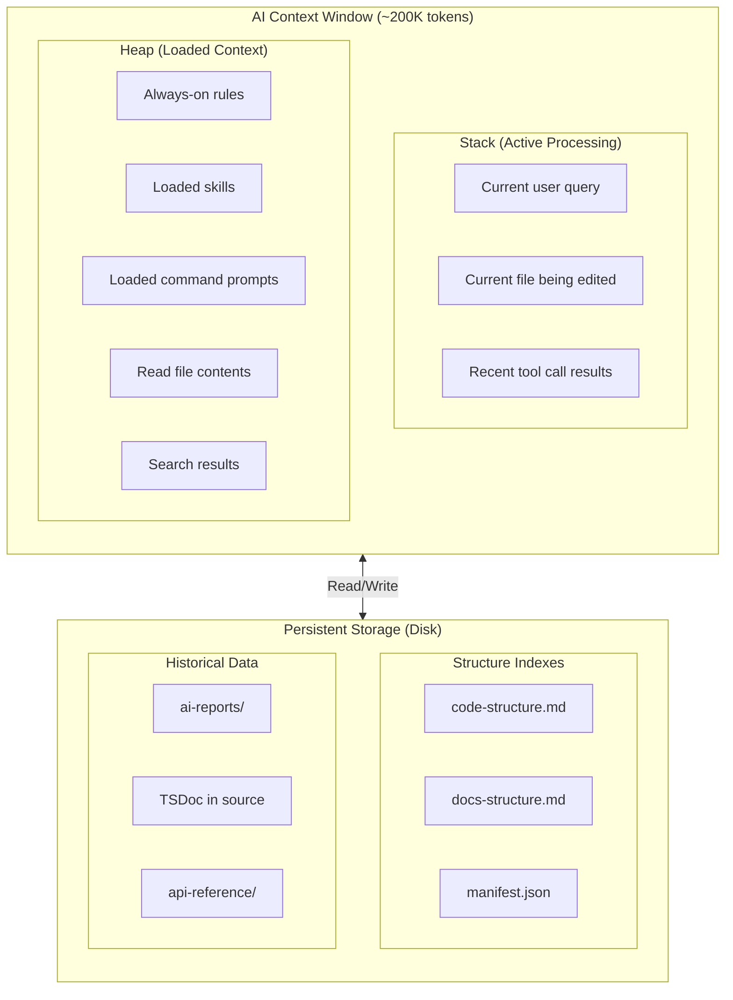

**Memory Access Pattern:**

| Condition | Action |
| --------- | ------ |
| Info needed | Check if in context (RAM) |
| In RAM | Use immediately |
| Not in RAM | Read from disk → Load into context → Use |

### Persistent State Management

**State Types:**

| State Type | Storage | Lifetime |
| ---------- | ------- | -------- |
| Session state | Context window | Single conversation |
| Project knowledge | Structure indexes | Until manually changed |
| API definitions | manifest.json | Until regenerated |
| Analysis history | ai-reports/ | Permanent (append-only) |
| Code documentation | TSDoc in source | With code lifecycle |

**Write Triggers:**

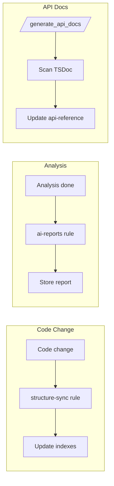

---

## Comparison: Traditional vs AI Programming

| Aspect | Traditional Programming | AI Programming (This System) |
| ------ | ----------------------- | ---------------------------- |
| **Compilation** | Source → Binary | Prompt → Behavior |
| **Type Safety** | Compiler enforces types | TSDoc + Rules enforce patterns |
| **Runtime Errors** | Exceptions, crashes | Wrong output, inconsistent behavior |
| **Debugging** | Debugger, stack traces | Read AI reasoning, check rule application |
| **Refactoring** | IDE tools, grep | AI applies rules automatically |
| **Documentation** | Generated from code | Generated AND guides AI |
| **Testing** | Unit tests, E2E | Prompt examples, constraint validation |
| **Version Control** | Git for source | Git for prompts + structure indexes |
| **Dependency Injection** | IoC containers | Skill loading, context injection |
| **Build Artifacts** | Binaries, bundles | Generated docs, reports |

---

## Overview

This project implements a **self-maintaining documentation system** where AI and documentation work together in a symbiotic loop:

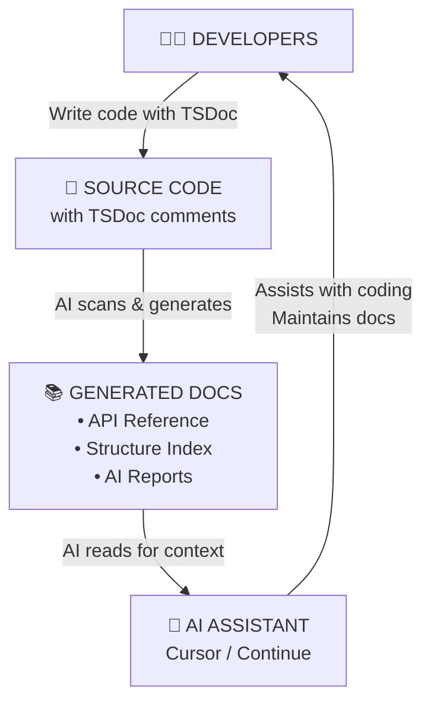

This creates three key benefits:

| Benefit | Description |
| ------- | ----------- |
| **Self-documenting** | TSDoc comments become the single source of truth for API docs |
| **Self-maintaining** | AI automatically updates structure indexes when code changes |
| **Self-aware** | AI reads generated docs to understand project context |

---

## System Architecture

### The Three Automation Loops

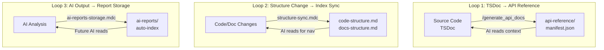

| Loop | Trigger | Output | Feedback |
| ---- | ------- | ------ | -------- |
| 1 | `/generate_api_docs` | api-reference/, manifest.json | AI reads for context |
| 2 | Code/Doc changes | Structure indexes | AI reads for navigation |
| 3 | AI analysis completed | ai-reports/ | Future AI reads for continuity |

---

## Component Overview

### 1. AI Configuration Layer (`.cursor/`)

The AI configuration layer defines rules, commands, and skills that control AI behavior.

```
.cursor/
├── rules/                    # Always-on rules (auto-applied)
│   ├── code-standards.mdc    # → Enforce code quality
│   ├── tsdoc-standard.mdc    # → Enforce TSDoc documentation
│   ├── ai-reports-storage.mdc# → Control report storage
│   ├── structure-sync.mdc    # → Trigger index updates
│   └── continuie.mdc         # → Protect Continue directory
│
├── commands/                 # User-triggered prompts
│   ├── generate_api_docs.md  # → /generate_api_docs
│   ├── project_evaluation.md # → /project_evaluation
│   └── skill_api_lookup.md   # → /skill_api_lookup
│
└── skills/                   # Reusable AI skills
    ├── e2e-testing/SKILL.md
    └── github-issue-creator/SKILL.md
```

| Type | Activation | Purpose |
| ---- | ---------- | ------- |
| **Rules** (`.mdc`) | Always applied | Enforce standards automatically |
| **Commands** (`.md`) | User invokes `/command_name` | Execute specific tasks |
| **Skills** (`SKILL.md`) | AI reads when relevant | Provide domain knowledge |

### 2. Documentation Site (`docs-site/`)

VitePress-based documentation with auto-discovery.

```
docs-site/
├── .vitepress/
│   ├── config.ts              # VitePress configuration
│   └── sidebar/
│       ├── index.ts           # Combines all sidebars
│       ├── guide.ts           # /guide/ sidebar
│       ├── developer-guide.ts # /developer-guide/ sidebar
│       ├── api-reference.ts   # /api-reference/ sidebar
│       └── ai-reports.ts      # /ai-reports/ sidebar (AUTO-SCAN)
│
├── guide/                     # User-facing documentation
├── developer-guide/           # Developer documentation
│   ├── code-structure.md      # 📍 Code structure index (AI-maintained)
│   ├── docs-structure.md      # 📍 Docs structure index (AI-maintained)
│   └── standards/             # Development standards
│
├── api-reference/             # 📍 Auto-generated from TSDoc
│   ├── _meta/
│   │   ├── manifest.json      # API index for AI context
│   │   └── source-map.json    # Doc ↔ source mappings
│   ├── babylon-editor/
│   ├── monaco-editor/
│   ├── agent/
│   └── shared/
│
└── ai-reports/                # 📍 AI-generated reports
    ├── code_quality_issues/   # Auto-discovered as sidebar section
    └── project_evaluation_reports/
```

### 3. Information Flow

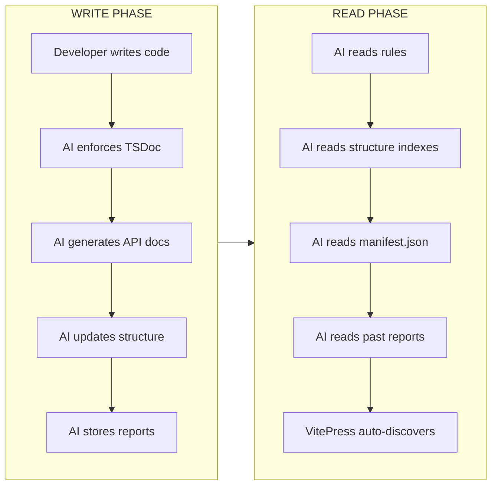

---

## Loop 1: TSDoc → API Reference

### Purpose

Convert source code comments into structured API documentation that both developers and AI can use.

### How It Works

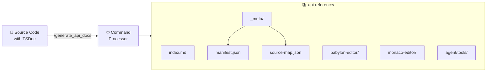

### Key Components

| Component | Path | Purpose |
| --------- | ---- | ------- |
| TSDoc Rule | `.cursor/rules/tsdoc-standard.mdc` | Enforces TSDoc on all exports |
| TSDoc Standard | `docs-site/developer-guide/standards/tsdoc-standard.md` | Full documentation standard |
| Generation Command | `.cursor/commands/generate_api_docs.md` | Triggers API doc generation |
| API Output | `docs-site/api-reference/` | Generated documentation |
| Manifest | `api-reference/_meta/manifest.json` | API index for AI retrieval |

### Manifest.json Structure

The manifest serves as an AI-readable index of all APIs:

```json
{
  "version": "1.0.0",
  "generatedAt": "2026-01-27T12:00:00.000Z",
  "modules": {
    "babylon-editor": {
      "displayName": "Babylon Editor",
      "stats": { "types": 52, "functions": 48 },
      "categories": [
        { "name": "Entity", "count": 8 },
        { "name": "Component", "count": 6 }
      ]
    }
  },
  "globalIndex": {
    "types": {
      "EntityData": { "module": "babylon-editor", "path": "..." }
    },
    "tools": {
      "babylon_create_entity": { "group": "Entity", "brief": "..." }
    }
  }
}
```

### TSDoc Requirements

Every exported symbol MUST have:

| Tag | When Required | Example |
| --- | ------------- | ------- |
| `@param` | All parameters | `@param name - Entity display name` |
| `@returns` | Non-void returns | `@returns Created entity ID` |
| `@throws` | Can throw errors | `@throws {Error} When entity not found` |
| `@example` | Public APIs | Code example block |
| `@category` | All exports | `@category Entity` |

---

## Loop 2: Structure Change → Index Sync

### Purpose

Keep structure index documents (`code-structure.md`, `docs-structure.md`) synchronized with actual project structure.

### How It Works

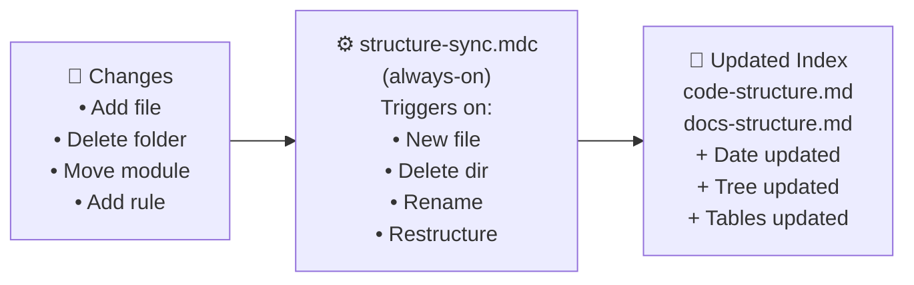

### Trigger Conditions

| Category | Triggers |
| -------- | -------- |
| **Code Structure** | Add/delete/rename directories, Add important modules, Restructure files |
| **Docs Structure** | Add/delete/rename docs, Modify sidebar, Add rules/commands/skills |

### Structure Document Format

```markdown
# Project Code Structure Index

> **Purpose**: AI quick navigation
> **Maintainer**: AI (automatic)
> **Last Updated**: YYYY-MM-DD

## Directory Overview

\`\`\`
module/
+-- subfolder/
|   +-- file1.ts
|   +-- file2.ts
+-- index.ts
\`\`\`

| File | Description | AI Usage |
| ---- | ----------- | -------- |
| subfolder/ | 📁 Folder purpose | When to check |
| file1.ts | File purpose | When to check |
```

### Why This Matters

| Without Sync | With Sync |
| ------------ | --------- |
| AI reads outdated index | AI reads accurate index |
| ↓ AI navigates to wrong location | ↓ AI finds correct location |
| ↓ AI generates incorrect code | ↓ AI generates correct code |
| ↓ **Developer fixes AI mistakes** | ↓ **Developer ships faster** |

---

## Loop 3: AI Output → Report Storage

### Purpose

Ensure all AI-generated analysis, reports, and documentation are stored in discoverable locations.

### How It Works

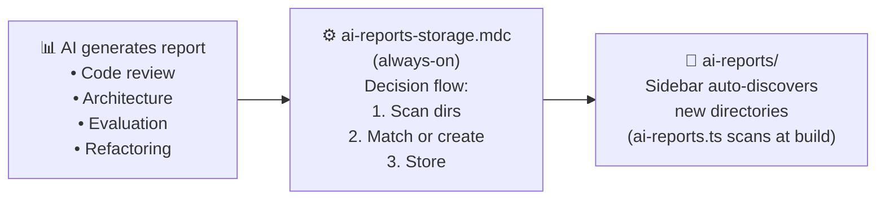

### Storage Decision Flow

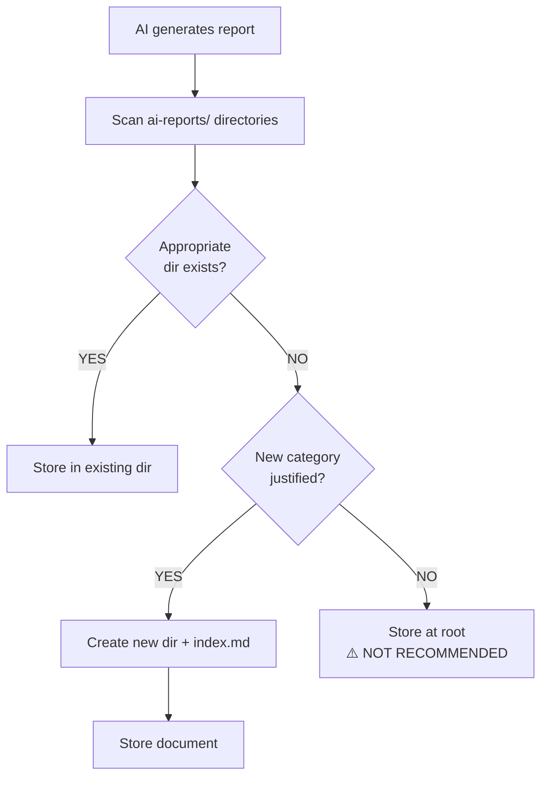

### Directory Categories

| Directory | Contents | File Naming |
| --------- | -------- | ----------- |
| `code_quality_issues/` | SRP violations, refactoring reports | `ISSUE_XXX_description.md` |
| `project_evaluation_reports/` | Architecture reviews, audits | `YYYY-MM-DD_HH-mm.md` |
| `security_audits/` | Security reviews (suggested) | `YYYY-MM-DD_topic.md` |
| `optimization_suggestions/` | Performance reports (suggested) | `descriptive-name.md` |

### Sidebar Auto-Discovery

The `ai-reports.ts` sidebar configuration dynamically scans the `ai-reports/` directory:

```typescript
// Simplified from docs-site/.vitepress/sidebar/ai-reports.ts
function buildAiReportsSidebar() {
  const entries = fs.readdirSync(AI_REPORTS_DIR)
  
  for (const entry of entries) {
    if (isDirectory(entry)) {
      // Creates collapsible section with all .md files
      sidebar.push({
        text: `📂 ${formatTitle(entry)}`,
        items: scanDirectory(entry)
      })
    }
  }
  
  return sidebar
}
```

---

## AI Context Flow

### How AI Gains Project Understanding

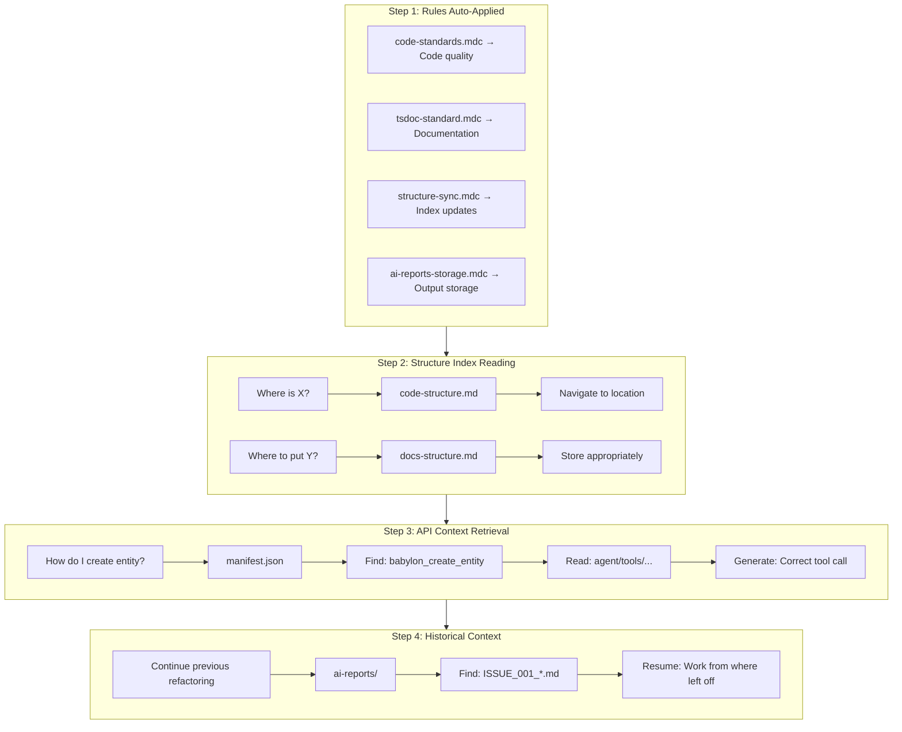

**Context Acquisition Steps:**

| Step | Input | Action | Output |
| ---- | ----- | ------ | ------ |
| 1 | Session start | Load kernel rules | Behavioral constraints |
| 2 | "Where is X?" | Read structure indexes | Navigation paths |
| 3 | "How to use API?" | Query manifest.json | API definitions |
| 4 | "Continue task" | Read ai-reports/ | Historical context |

---

## Configuration Reference

### Rule Configuration Format (`.mdc`)

```yaml
---
description: Brief description of the rule
globs:                           # Files that trigger this rule
  - "**/*.ts"
  - "**/*.tsx"
alwaysApply: true                # Always apply (vs. manual trigger)
---

# Rule Title

Rule content in markdown...
```

### Command Configuration Format (`.md`)

````markdown
# Command Name

> Scope: When to use this command
> Goal: What this command achieves

---

## Role

You are [role description]...

---

## Input

**[ENV]**
Project: ${project_name}
Date: ${date}
**[/ENV]**

---

## Process

### Phase 1: ...
### Phase 2: ...

---

## Output Format

[Template for output]

---

## Constraints

**[CONSTRAINTS]**
- MUST: ...
- NEVER: ...
**[/CONSTRAINTS]**
````

### Skill Configuration Format (`SKILL.md`)

```markdown
# Skill Name

Brief description of what this skill enables.

## When to Use

- Condition 1
- Condition 2

## How to Use

Step-by-step instructions...

## Examples

Example usage...
```

---

## Implementation Checklist

### Setting Up AI-Driven Documentation

| Step | Action | Verification |
| ---- | ------ | ------------ |
| 1 | Create `.cursor/rules/` directory | Directory exists |
| 2 | Add `tsdoc-standard.mdc` with enforcement rules | Rule auto-applies |
| 3 | Add `structure-sync.mdc` with trigger conditions | Indexes update on changes |
| 4 | Add `ai-reports-storage.mdc` with storage rules | Reports stored correctly |
| 5 | Create `docs-site/developer-guide/code-structure.md` | AI can navigate code |
| 6 | Create `docs-site/developer-guide/docs-structure.md` | AI can navigate docs |
| 7 | Create `docs-site/api-reference/_meta/manifest.json` | AI has API index |
| 8 | Configure sidebar auto-discovery | New directories appear |
| 9 | Add `/generate_api_docs` command | API docs regeneratable |
| 10 | Test full loop with a code change | Everything syncs |

### Verification Commands

```bash
# Check rule files exist
ls .cursor/rules/*.mdc

# Check structure documents exist
ls docs-site/developer-guide/code-structure.md
ls docs-site/developer-guide/docs-structure.md

# Check manifest exists
cat docs-site/api-reference/_meta/manifest.json | head -20

# Check sidebar auto-discovery
ls docs-site/ai-reports/

# Build and verify
npm run docs:build
```

---

## Best Practices

### For Developers

| Practice | Why |
| -------- | --- |
| Always write TSDoc for exports | AI generates accurate API docs |
| Use `@category` tags consistently | API docs are organized logically |
| Include `@example` for public APIs | AI learns correct usage patterns |
| Update structure indexes after refactoring | AI maintains accurate navigation |

### For AI Rules

| Practice | Why |
| -------- | --- |
| Use `alwaysApply: true` for critical rules | Rules apply without manual trigger |
| Be specific with glob patterns | Rules apply only where needed |
| Include examples in rules | AI learns from examples |
| Keep rules focused (single responsibility) | Easier to maintain and debug |

### For Commands

| Practice | Why |
| -------- | --- |
| Define clear output format | Consistent, predictable results |
| Include constraints section | Prevent common mistakes |
| Provide good/bad examples | AI learns boundaries |
| Use phases for complex workflows | AI follows structured process |

---

## Troubleshooting

### AI Not Following Rules

| Symptom | Cause | Solution |
| ------- | ----- | -------- |
| Rule not applied | Missing `alwaysApply: true` | Add to frontmatter |
| Rule partially applied | Glob pattern too narrow | Expand glob patterns |
| Rule conflicts | Multiple rules contradict | Review and consolidate |

### Structure Index Out of Sync

| Symptom | Cause | Solution |
| ------- | ----- | -------- |
| AI navigates to wrong location | Index not updated | Manually update index |
| New modules not found | Not added to index | Add new entries |
| Date not updated | Forgot to update | Update "Last Updated" |

### API Docs Not Generated

| Symptom | Cause | Solution |
| ------- | ----- | -------- |
| Missing documentation | No TSDoc comments | Add TSDoc to exports |
| Wrong categorization | Missing `@category` | Add category tags |
| Not in manifest | Generation not run | Run `/generate_api_docs` |

---

## Summary

The AI-driven documentation system creates a self-maintaining ecosystem:

```
┌─────────────────────────────────────────────────────────────────────┐
│                         KEY TAKEAWAYS                                │
├─────────────────────────────────────────────────────────────────────┤
│                                                                      │
│  1. TSDoc is the source of truth                                     │
│     - Write once in code, appears everywhere                         │
│     - AI generates API docs automatically                            │
│     - manifest.json enables AI retrieval                             │
│                                                                      │
│  2. Structure indexes enable navigation                              │
│     - AI reads indexes before exploring                              │
│     - Always sync indexes with actual structure                      │
│     - Enables AI to find anything quickly                            │
│                                                                      │
│  3. Rules enforce consistency                                        │
│     - alwaysApply rules run automatically                            │
│     - No human oversight needed                                      │
│     - AI maintains its own documentation                             │
│                                                                      │
│  4. Reports create institutional knowledge                           │
│     - All AI analysis is preserved                                   │
│     - Future AI sessions can read history                            │
│     - VitePress auto-discovers new content                           │
│                                                                      │
│  Result: Documentation that maintains itself                         │
│                                                                      │
└─────────────────────────────────────────────────────────────────────┘
```

---

## Related Documentation

| Document | Purpose |
| -------- | ------- |
| [TSDoc Standard](./standards/tsdoc-standard.md) | Full TSDoc specification |
| [AI Reports Standard](./standards/ai-reports-standard.md) | Report storage rules |
| [Code Structure Index](./code-structure.md) | Navigate code modules |
| [Docs Structure Index](./docs-structure.md) | Navigate documentation |
| [Git Commit Standard](./standards/git-commit-standard.md) | Commit message format |
