# Lifecycle & Sequence Chains

> The **operational** map of Archon: every route a session can take, in order, with the file that defines each step and whether the step is **mechanically gated** (a run-state row / contract clause / test) or **prose-only**. This is the "is the business controllable, with no deviation?" reference — read it alongside the [Architecture Reference](/concepts/architecture) (structure) and [The Five Pillars](/concepts/five-pillars) (the why).
>
> Distinct from [User Journeys](/concepts/user-journeys), which maps 16 *pitfalls* to the mechanisms that catch them. This page maps the *control flow* itself.
>
> Every journey below carries a diagram; the cross-cutting views you need for **business tracking and maintenance** — install, update/sync, drift state machine, records data-flow, evolution dual-motion — are collected in [§7 Tracking & maintenance diagram pack](#_7-tracking-maintenance-diagram-pack).

Everything below is one cognitive loop — `Perceive → Model → Act → Verify`, with backtracking — wearing three different hats. The hats are the wake modes; the loop is invariant.

| Wake mode | Command | Purpose | Soul extension loaded |
|-----------|---------|---------|------------------------|
| **Plan** | [`/archon-plan`](/source/commands/archon-plan) | Negotiate *what* / *how big* / *what risk* | `soul/review.md` |
| **Demand** | [`/archon-demand`](/source/commands/archon-demand) | Execute one scoped delivery end-to-end | `soul/delivery.md` |
| **Review** | [`/archon-review`](/source/commands/archon-review) | Independent full-review when drift pressure crosses a threshold | `soul/review.md` |

---

## 0. Wake & routing

Source: [`archon-wake.mdc`](/source/rules/archon-wake) · [`archon.md`](/source/commands/archon).

| # | Step | Defined in | Gate |
|---|------|-----------|------|
| 0.1 | Load framework primer (first wake of the session only) | `archon-framework/SKILL.md` | mechanical (once) |
| 0.2 | Hot-path soul read (identity / routing sections only) | `soul.md` §Core Axioms · §Ownership · §Cognitive Loop · §Autonomy | mechanical |
| 0.3 | Hot-path manifest read (current state, glossary, ULI, validation cmd) | `manifest.md` (section-scoped) | mechanical |
| 0.4 | **Drift Precheck (Hard Gate)** | `archon.md` §Step 0 | **hard gate** |
| 0.5 | Route to plan / demand / review (explicit prefix or inferred) | `archon.md` §Routing | mechanical |

The **Drift Precheck** is the master safety interlock (thresholds from [`governance-contract.yaml`](/source/contracts/governance-contract) `drift_gate`):

- `drift ≥ 20` (emergency) → **halt all demand intake**, force review.
- `drift ≥ 12` (full) → **block demand**, allow only review.
- `drift ≥ 6` (light) → advisory: insert a light review before the next medium/large demand.

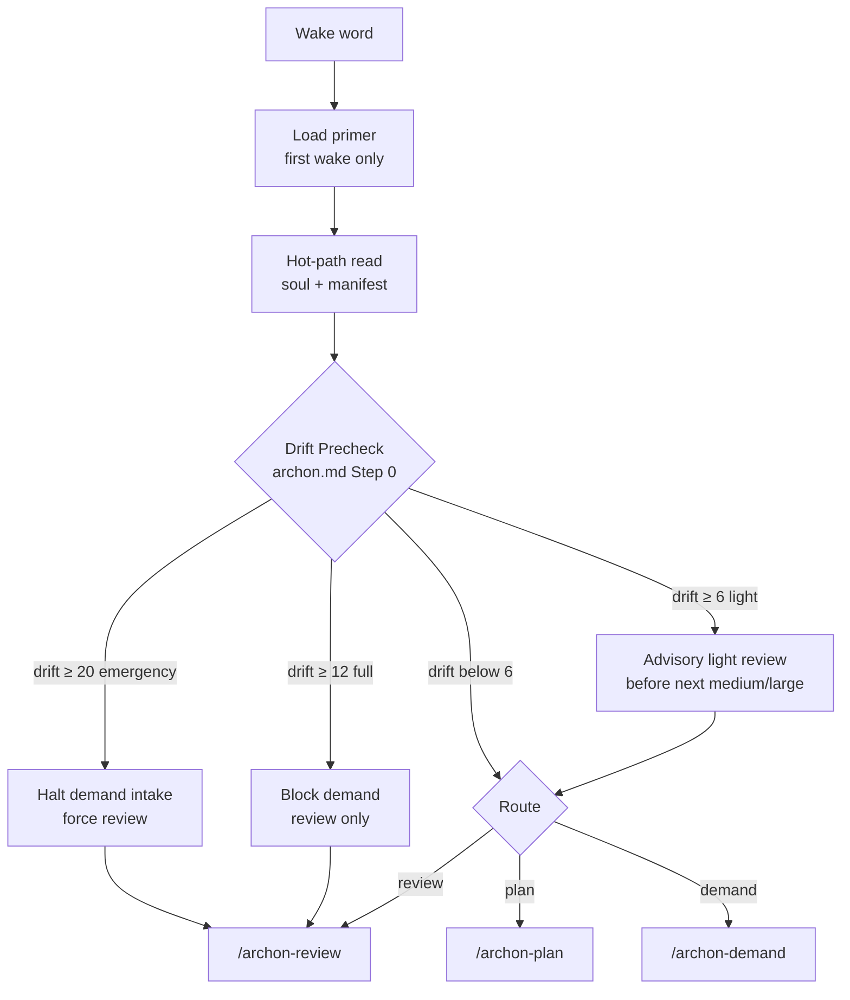

> Why a hard gate and not prose: history showed drift reaching 108% of the full threshold while demands kept executing. ADR-9 promoted the precheck from L3 prose to an L1 test. See [Drift Mechanism](/concepts/drift-mechanism).

## 1. Plan journey

Source: [`archon-plan.md`](/source/commands/archon-plan) (loads `soul/review.md`).

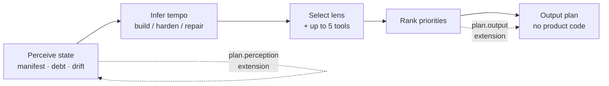

1. **State perception** — read manifest, `debt.md`, `drift.md`. *(extension point: `plan.perception`)*
2. **Tempo inference** — derive build / harden / repair bias from state signals, **not** a mode flag (soul §Evolution Tempo): early milestone → build; gates failing → harden; debt deadlines near → repair; ≥3 of last 5 drift entries same-type → stagnation.
3. **Domain-lens + tool selection** — pick ≤5 (preferred 3) reasoning tools within the load budget ([`domain-lenses/registry.yaml`](/source/domain-lenses/registry)).
4. **Priority ranking → output.** *(extension point: `plan.output`)*

Plan negotiates; it does not write product code. That is the demand journey's job.

## 2. Demand journey (the core lifecycle)

Source: [`archon-demand.md`](/source/commands/archon-demand) (loads `soul/delivery.md`). Run-state rows from [`run.template.md`](/source/runtime-templates/run.template).

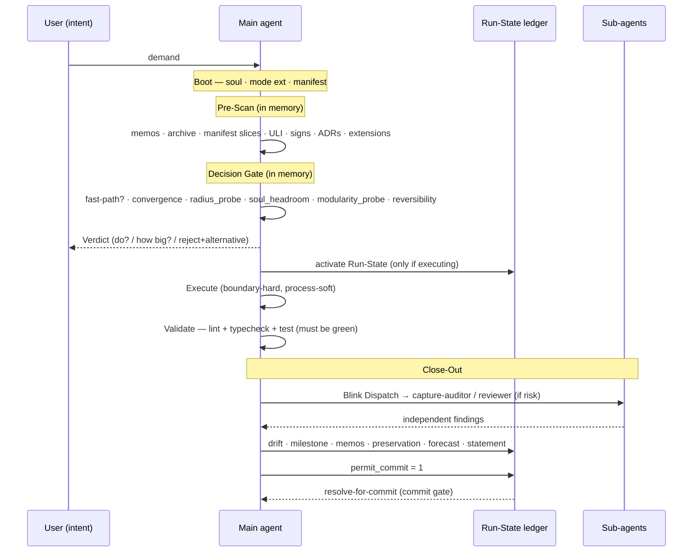

**Run-State Lazy Activation** (`archon-demand.md` §Run-State Lazy Activation): Pre-Scan and the Decision Gate run *in memory* so a rejected or tiny demand answers fast; Run-State is written only after the Verdict, if the delivery will execute / needs reject-evidence / will be committed.

### Ordered steps + their run-state checkpoints

| Phase | Step | run-state key | Gate |
|-------|------|---------------|------|
| Boot | soul / mode-ext / manifest loaded | `boot.soul_loaded` · `boot.mode_extension_loaded` · `boot.manifest_loaded` | mechanical |
| Pre-Scan | memos scan | `prescan.memos_scanned` | soul-enforced |
| Pre-Scan | archive recall (keyword-matched) | `prescan.archive_scanned` | smart-skippable |
| Pre-Scan | **manifest slice scan** (ADR-32, if `slices/` exists) | folds into manifest load | conditional |
| Pre-Scan | user-language alias scan · signs sweep | — | mechanical sweep |
| Pre-Scan | ADR index scan · extension `demand.pre-scan` hooks | `prescan.adrs_scanned` · `prescan.extensions_hooked` | mechanical |
| Decision | fast-path assessment | `decision.fastpath_assessed` | mechanical |
| Decision | convergence classify (if manifest declares scope) | `decision.convergence_classified` | **gate** (ADR-12) |
| Decision | `radius_probe:` · `soul_headroom:` · `modularity_probe:` (slice-aware) | — | mechanical probes |
| Decision | plan-mode binding · **Verdict** (+ `Borrowed concepts (if any):` · `Override (if any):`) | `decision.plan_mode_declared` · `decision.verdict_output` | **hard gate** (ADR-11) |
| Execute | self-directed interior (boundary-hard, process-soft) | `execute.changes_applied` | soul-enforced if files changed |
| Validate | lint + typecheck + test green | `validate.validation_green` | **hard gate** (never user-skippable when code changed) |
| Close-Out | manifest + slice sync | `closeout.manifest_synced` | soul-enforced |
| Close-Out | Blink Dispatch → sub-agent | `closeout.subagent_dispatched` | gate (high-risk MUST NOT skip) |
| Close-Out | capture-auditor ran / processed | `closeout.auditor_ran` · `closeout.auditor_processed` | smart-skippable |
| Close-Out | drift updated | `closeout.drift_updated` | soul-enforced |
| Close-Out | milestone gate · memos appended · extensions | `closeout.milestone_gate` · `closeout.memos_appended` · `closeout.extensions_hooked` | smart-skippable |
| Close-Out | preservation pass · acceptance-delta · numeric cross-check · governance-docs mirror · architecture forecast · **Final Imperative** | (folded) | mechanical self-check |
| Close-Out | statement output | `closeout.statement_output` | soul-enforced |
| Git | `permit_commit: 1` → `resolve-for-commit` | `permit_commit` | **commit gate** |

The **Verdict** is the pivot: it is produced *before any write-side tool invocation* (ADR-11, pinned by contract). The **Validation Gate** and **Close-Out** are the two hard checkpoints after — nothing reaches a commit until `validate.validation_green` is `1` and `permit_commit` is set, which [`archon-run-state.mjs resolve-for-commit`](/source/scripts/archon-run-state) verifies.

## 3. Review journey

Source: [`archon-review.md`](/source/commands/archon-review) (loads `soul/review.md`). Three tiers (thresholds in `drift_gate`):

| Tier | Trigger | What runs | Reset |
|------|---------|-----------|-------|
| **Light** | drift ≥ 6 | Mechanical health audit only (≤10% of full cost) | releases 2–4 points |
| **Full** | drift ≥ 12 | Independent **reviewer** sub-agent + 4-phase audit | resets to 0–3 |
| **Emergency** | drift ≥ 20 | Demand intake halted + blindspot root-cause + forced remediation | resets |

Guard: **"Light cannot satisfy a Full-threshold crossing"** (pinned in both `soul/review.md` and `archon-review.md`) — a light pass cannot be used to clear a drift level that demanded a full review.

The drift counter is the state machine that drives review cadence (thresholds shift by project phase — see [Drift Mechanism](/concepts/drift-mechanism)):

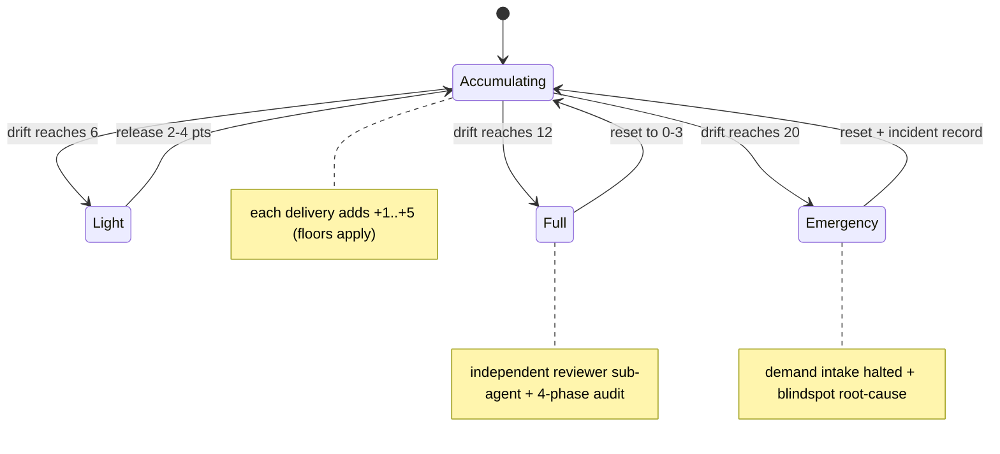

## 4. The run-state ledger (the spine)

[`run.template.md`](/source/runtime-templates/run.template) + `run-state.schema.json` are the machine-readable trace of one delivery. 22 status keys, each `0` (pending) / `1` (done) / `skip:<reason>` / `2` (smart-skip by user intent, ADR-15). Only six rows are smart-skippable (`prescan.archive_scanned`, the two auditor rows, `memos_appended`, `milestone_gate`, `extensions_hooked`); the rest are soul-enforced. `permit_commit: 1` is the final gate, inspected by the pre-commit hook and the `archon-git-commit` skill.

The phase progression a tracker watches — each transition flips run-state rows; the commit is unreachable until the gate passes:

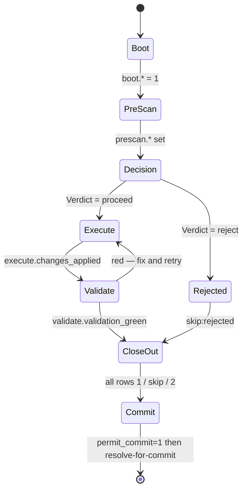

This is what makes the lifecycle *auditable*: a delivery cannot quietly skip a load-bearing step, because the skipped row is visible and `resolve-for-commit` blocks the commit.

## 5. Sub-agent dispatch (independence layer)

Source: [`blink-dispatch/SKILL.md`](/source/skills/blink-dispatch) + [`archon-reviewer`](/source/agents/archon-reviewer) / [`archon-capture-auditor`](/source/agents/archon-capture-auditor).

At Close-Out, **Blink Dispatch** thin-slices the completed diff and emits `subagent_dispatch: skip:<reason> | use:<subagent>:<reason>`. High-risk paths (scripts, contracts, soul, commands, agents — `blink_dispatch.high_risk_path_patterns`) **MUST NOT skip**. Two sub-agents exist, both expected to run on a *different model family* than the main agent (soul §Sub-Agent Independence) to counter sunk-cost bias:

- **reviewer** — cycle-level, spawned at the full-review threshold.
- **capture-auditor** — per-delivery, spawned when Blink detects implementation / governance / boundary / repair / state-closure / uncertainty risk.

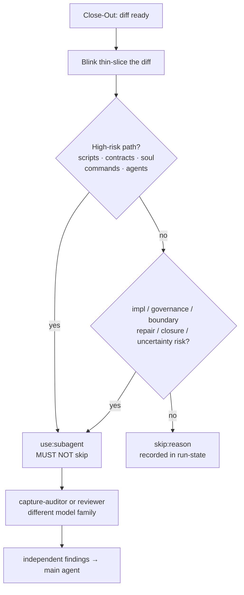

## 6. Where the v0.2.0 mechanisms sit

The memory upgrades from [ADR-31 / ADR-32](/concepts/decisions) plug into existing slots — no new run-state keys, no new Verdict tokens:

- **Onboarding self-scan** (ADR-31) is an *install-time* step (`install.md` §7b), before any wake — it bootstraps the manifest the wake step then reads.
- **Manifest slice scan** (ADR-32) is a *pre-scan* step (table row above): matching slices are loaded on demand, folding into the same `manifest_loaded` / `manifest_synced` checkpoints. Absence of `.archon/manifest/slices/` = single-scope behaviour, so the chain is unchanged for projects that don't use it.

## 7. Tracking & maintenance diagram pack

The cross-cutting views a maintainer or auditor needs — these span sessions rather than living inside one wake.

### 7.1 Install / onboarding (one-time)

Source: [`install.md`](https://aaep.site/install.md) · [`skill.md`](https://aaep.site/skill.md). The v0.2.0 additions (template seeding + self-scan) are steps 7 and 7b.

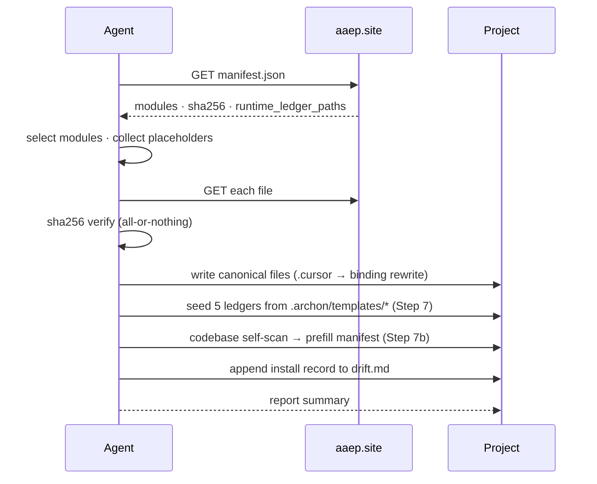

### 7.2 Update vs Sync — and what stays untouched

The maintenance invariant: framework files are replaceable, **runtime ledgers are adopter-owned and never overwritten** (`manifest.runtime_ledger_paths`).

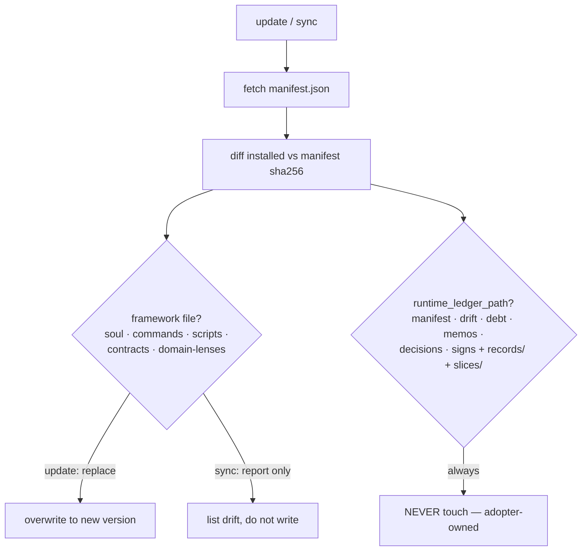

### 7.3 State-file data flow (records → hot summary → archive)

Per ADR-22 — the event-sourced trail behind every `drift` / `memos` / `debt` number. This is the audit chain for business tracking.

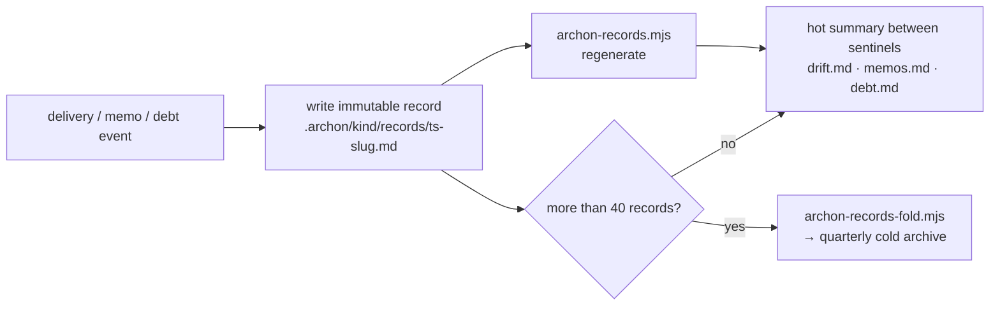

### 7.4 Knowledge evolution — the dual motion at Close-Out

Source: `soul.md` §Evolution. Every delivery answers both questions; the preservation answer is mechanically verified (`archon-claim-verifier --mode=preservation`).

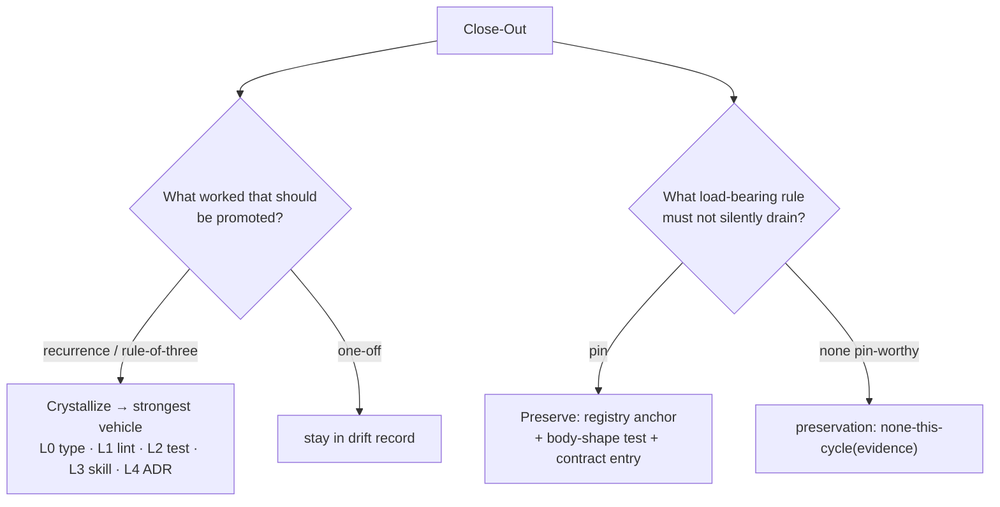

### 7.5 Manifest-slice load (ADR-32, large / monorepo only)

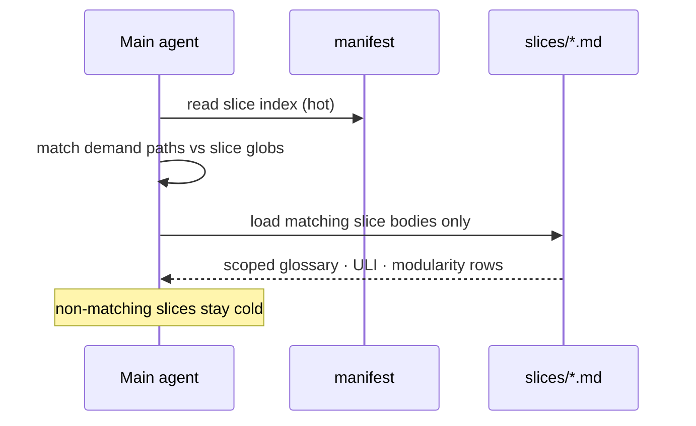

## 8. Why this stays controllable

Every load-bearing step above is anchored at the lowest enforceable level (the [Constraint Pyramid](/concepts/five-pillars#_2-mechanical-gates-fail-closed-don-t-rely-on-prose)): hard gates (drift precheck, Verdict-before-write, validation-green, permit_commit) fail closed; the run-state ledger makes every skip visible; and the contract's `critical_rule_substrings` pin the anchors so a later edit cannot silently drain them. Deviation is not prevented by trust — it is prevented by the gate that stops the commit.
