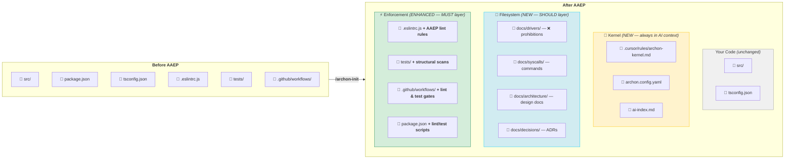
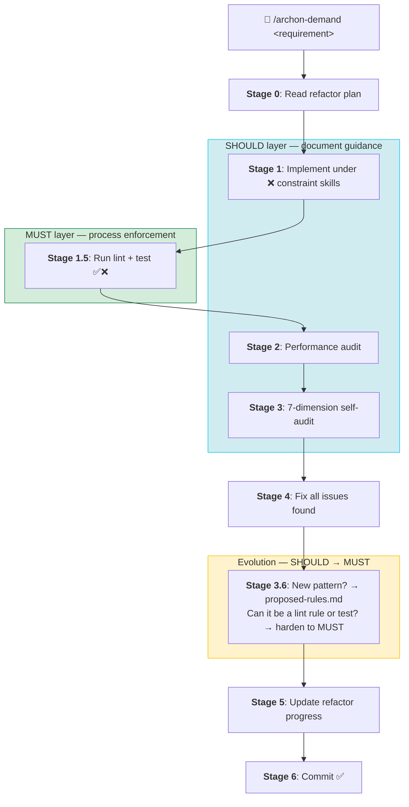

# Getting Started

Archon Protocol is a constraint system that turns AI coding agents into reliable architects. It provides agents, skills, and constraints that guide AI behavior during development.

## What Changes in Your Project?

Before AAEP, your project is just source code. After AAEP, it gains a complete AI governance layer — documents guide AI decisions (SHOULD), lint & tests enforce compliance (MUST).



**Legend**: <span style="color:#ffc107">**Yellow**</span> = new kernel files (always resident in AI context) · <span style="color:#0dcaf0">**Blue**</span> = new document layer (SHOULD — guides AI generation) · <span style="color:#198754">**Green**</span> = enhanced enforcement layer (MUST — lint rules, structural tests, CI gates)

> Documents achieve **SHOULD** — they guide AI but can be compressed in long conversations.
> Processes achieve **MUST** — lint and tests run in their own process, unbypassable. ([ADR-003](/decisions/ADR-003-executable-enforcement))

## Prerequisites

- An AI coding tool: Cursor, Claude Code, Codex, VS Code with Copilot, or any tool supporting SKILL.md
- A project with source code

## Quick Install

```bash
bash archon-protocol/templates/install.sh
```

This deploys:
- **Agents** → `.cursor/agents/`, `.claude/agents/`
- **Skills** → `.cursor/skills/`, `.claude/skills/`, `.codex/skills/`
- **Config** → `archon.config.yaml`

## First Run

In your AI tool, type:

```
/archon-init
```

The init command scans your project, detects the tech stack, and confirms everything is deployed correctly.

## Daily Usage

### Feature development

```
/archon-demand Add dark mode toggle to settings
```

This triggers the full delivery pipeline: implement → performance audit → 6-dimension self-audit → fix → test sync → knowledge evolution → commit.

### Health check

```
/archon-audit
```

Read-only project-wide audit with a scored report (0-100).

### Architecture planning

```
/archon-refactor
```

Generates a progressive refactoring plan. Future `/archon-demand` calls automatically align with the plan.

## How It Works



- <span style="color:#0dcaf0">**Blue**</span> = SHOULD (document constraints guide generation)
- <span style="color:#198754">**Green**</span> = MUST (lint & test — unbypassable process enforcement)
- <span style="color:#ffc107">**Yellow**</span> = Evolution (new constraints graduate from SHOULD to MUST)

## Choosing the Right Mode

Not every task needs the full pipeline. Use opt-out flags to match the task:

| Scenario | Command | What runs |
|----------|---------|-----------|
| Complex feature | `/archon-demand add user settings` | All stages (full pipeline) |
| Quick hotfix | `/archon-demand quick fix typo in header` | Stages 0, 1, 1.5, 3.1–3.4, 4, 6 |
| Exploration (no commit) | `/archon-demand no-commit try new layout` | All stages except commit |
| Styling only | `/archon-demand quick skip-tests update button colors` | Stages 0, 1, 1.5, 3.1–3.3, 4, 6 |

**Decision tree:**

```
Is this a complex feature or refactor?
  → Yes: use full pipeline (no flags)
  → No:
      Is this a quick fix or small change?
        → Yes: add `quick`
      Do you want to review before committing?
        → Yes: add `no-commit`
      Is this purely visual (no logic change)?
        → Yes: add `skip-tests`
```

## Tool Compatibility

| Tool | What you get |
|------|-------------|
| **Cursor** | Agents (primary) + Skills |
| **Claude Code** | Agents (primary) + Skills |
| **Codex, Copilot, VS Code** | Skills only |
| **Any SKILL.md tool** | Skills only |

Agents provide isolated context windows. Skills provide the same workflows in a portable format.
