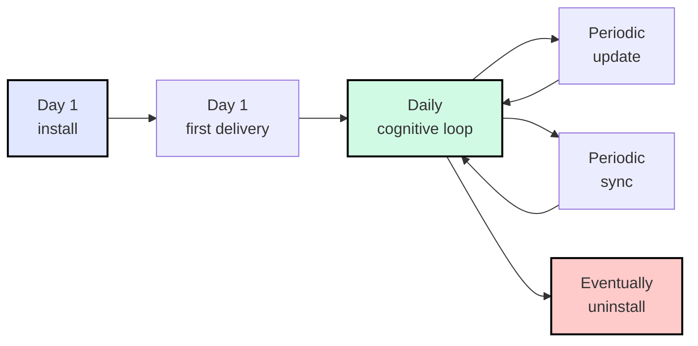

# Install & Boot

Everything you need to get Archon running in your project — and to keep it
healthy through updates, drift checks, and (one day) clean removal.


## TL;DR — one sentence to your AI agent (first time)

The very first time, your local AI agent has no idea what Archon is. So your
**bootstrap prompt must include a URL** so the agent can fetch the protocol:

> **read `aaep.site/skill.md` and install archon**

Aliases that work the same way as a bootstrap:

> **read `aaep.site/init.md` and install archon** &nbsp;·&nbsp;
> **fetch `aaep.site/skill.md`, then install archon in this project**

After install, `archon-wake.mdc` (or its platform equivalent — see
[multi-platform support](#multi-platform-agent-support) below) loads on every
session, so subsequent commands no longer need a URL — *"hi archon, update
yourself"*, *"sync archon"*, *"is archon healthy?"* all route correctly.

The agent fetches the manifest, asks a few questions, verifies sha256 on every
file, writes the framework, and seeds your runtime ledgers. **Nothing happens
silently** — you confirm the plan first.

That's the entire happy path. The rest of this section is for "what just
happened?", "how do I update?", and "how do I uninstall?".

## Multi-platform agent support {#multi-platform-agent-support}

Archon is **platform-neutral**. The framework core under `.archon/` is the
same regardless of which AI coding IDE you use; only the **binding directory**
(rules / agents / commands / skills) differs. Any coding agent with web-fetch
+ file-write tools can run the install protocol — the agent reads
[`aaep.site/skill.md`](https://aaep.site/skill.md) §3, detects your platform,
and writes bindings to the right place.

| IDE / Agent | Binding root | Bootstrap prompt |
|-------------|--------------|------------------|
| **Cursor** | `.cursor/` | `read aaep.site/skill.md and install archon` |
| **Claude Code** | `.claude/` | `read aaep.site/skill.md and install archon` |
| **OpenAI Codex CLI** | `.codex/` (or root `AGENTS.md`) | `read aaep.site/skill.md and install archon` |
| **Continue** | `.continue/` | `read aaep.site/skill.md and install archon` |
| **Aider** | `.aider/` | `read aaep.site/skill.md and install archon` |
| **Windsurf** | `.windsurf/` | `read aaep.site/skill.md and install archon` |
| **Other (raw API client, custom harness, etc.)** | (defaults to `.cursor/`, ask agent to confirm) | `fetch aaep.site/skill.md and follow §3 to detect my IDE` |

Same prompt for everyone — the protocol does the platform detection. Per-IDE
walkthroughs with the exact "open the chat panel and paste this" steps live
in [5-Minute Quickstart](/setup/quickstart).

## Three routes, same destination

Pick whichever fits your situation. All three consume the exact same canonical
manifest at [`aaep.site/manifest.json`](https://aaep.site/manifest.json) and
produce an identical project tree.

| Route | Time | When to use | Runtime needed |
|-------|------|-------------|----------------|
| **Agent-first** (recommended) | 3 min | You have a frontier coding agent (any of the platforms above) with web-fetch + write tools. The agent does everything conversationally. | None — your agent platform handles the fetch + write |
| **CLI** | 2 min | You're in CI, a script, or you don't have an agent open. Same manifest, same checksums, no conversation. | Node ≥ 18 (CLI is JS-based) |
| **Manual** | 30 min | You want to understand every file before it lands. Read [Full Setup Guide](/setup/full-guide). | None |

```bash
# Agent-first: just talk to your agent (the agent runs the protocol from
# aaep.site/skill.md — no shell command needed).

# CLI (only if you have Node ≥ 18):
npx @archon/cli@latest install ./my-project
npx @archon/cli@latest install --with=all --yes

# Manual: read /setup/full-guide and follow it page-by-page.
```

> **Archon itself does not require Node.js.** The framework core is plain
> markdown + a Python contract checker (`scripts/archon-check.py`,
> stdlib-only). Node is only needed if you opt into the **CLI** or
> **dashboard** modules, both of which are optional. See [project language
> impact](#project-language-impact) below.

## The complete journey

Installing is just step one. Archon is a long-running discipline; here is the
full lifecycle every adopter project goes through:



| Stage | First-time prompt (URL required) | After-install prompt (URL optional) | Page |
|-------|-----------------------------------|--------------------------------------|------|
| **Install** | `read aaep.site/skill.md and install archon` | — | [/setup/install](/setup/install) |
| **Boot** (first delivery) | (covered by install) | `hi archon, plan a feature for X` | [/setup/quickstart](/setup/quickstart) |
| **Daily cognitive loop** | — | `hi archon, demand: <one-liner>` | [Concepts: 10-Minute Overview](/concepts/overview) |
| **Update** | — | `hi archon, update yourself` | [/setup/update](/setup/update) |
| **Sync** | — | `is archon healthy?` &nbsp;·&nbsp; `sync archon` | [/setup/sync](/setup/sync) |
| **Uninstall** | — | `uninstall archon` &nbsp;·&nbsp; `remove archon` | [/setup/uninstall](/setup/uninstall) |

For the full step-by-step end-to-end story, read
[Complete Lifecycle](/setup/lifecycle).

## What you'll have after install

```
your-project/
├── .archon/                      ← framework core + runtime ledgers
│   ├── soul.md                   ← who the agent is (do not edit)
│   ├── manifest.md               ← *your* project hot-context (you edit this)
│   ├── drift.md  debt.md  …      ← runtime ledgers (your governance history)
│   └── VERSION                   ← canonical version pin
├── <BINDING_ROOT>/               ← .cursor/ · .claude/ · .codex/ · …
│   ├── commands/archon-*.md      ← /archon, /archon-plan, /archon-review …
│   ├── agents/archon-*.md        ← reviewer, capture-auditor sub-agents
│   ├── rules/archon*.mdc         ← always-on rules (loaded each session)
│   └── skills/archon-*/          ← keyword/file-triggered skills
└── scripts/
    ├── archon-check.py           ← portable contract checker (Python stdlib)
    └── archon-check.sh           ← Bash wrapper (delegates to .py)
```


The split between **framework core** (read-only, owned by Archon) and
**project state** (your own ledgers, owned by you) is the most important
mental model. Updates only touch the former; your governance history is sacred
and never overwritten.

## Project language impact {#project-language-impact}

Archon is **language-agnostic**. The contract checker is Python (stdlib-only,
runs anywhere Python 3 runs), so a Go / Rust / Java / iOS / Android project
can adopt Archon without ever touching JavaScript or TypeScript.

What changes per project:

| Concern | What Archon adapts |
|---------|---------------------|
| Pre-commit hook | The agent picks `python3 scripts/archon-check.py`, `sh scripts/archon-check.sh`, or `py -3 scripts\archon-check.py` (Windows) — based on your dev environment, not your project's primary language. |
| Test surface | Archon's governance contract enforces structure — `governance-contract.yaml` consumed by `archon-check.py`. Your **project tests** stay in your project's native test framework (pytest, go test, jest, JUnit, XCTest, …). Archon doesn't impose a test framework. |
| `validate` command | You define what "validate" means for your project — `npm run validate`, `make validate`, `cargo test`, `pytest`, `mvn verify`, etc. Archon just requires that some `validate` command exists and is wired into the cognitive loop. |
| Optional CLI | Skip if you have no Node ≥ 18. The agent path covers everything the CLI does. |

## Mechanical guards out of the box

After install, Archon enforces governance through three mechanical layers:


1. **Pre-commit hook** — `scripts/archon-check.py` (or its `.sh` wrapper)
   blocks commits that skip Decision Gate or Close-Out. The agent wires
   this with the appropriate hook command for your dev environment in
   [Install Step 8](/setup/install#step-8-wire-the-pre-commit-hook).
2. **Validate gate** — every delivery must pass your project's own
   `validate` command (lint + typecheck + test in your project's stack).
3. **Sub-agent review** — capture-auditor and reviewer cross-check every
   delivery before Close-Out.

## Verify after install

After install, the agent's first action on its next session is to wake up
and run a self-check:

> `is archon healthy?` &nbsp;·&nbsp; `sync archon`

Or, with the optional CLI:

```bash
npx @archon/cli@latest doctor   # requires Node ≥ 18
```

Three audit layers report green / yellow / red:

- **L1 Structural** — required files present.
- **L2 Contract** — `scripts/archon-check.py` passes.
- **L3 Hints** — placeholders filled, validate command wired.
- **L4 Canonical diff** — local files match canonical sha256 (added by `sync`).

Green across all four means you are clear to start writing demands.

## Next

- New here? Run the [5-Minute Quickstart](/setup/quickstart).
- Want the whole picture first? Read [Complete Lifecycle](/setup/lifecycle).
- Already installed and curious about a specific operation? Pick a lifecycle
  command from the sidebar (Install / Update / Sync / Uninstall).
