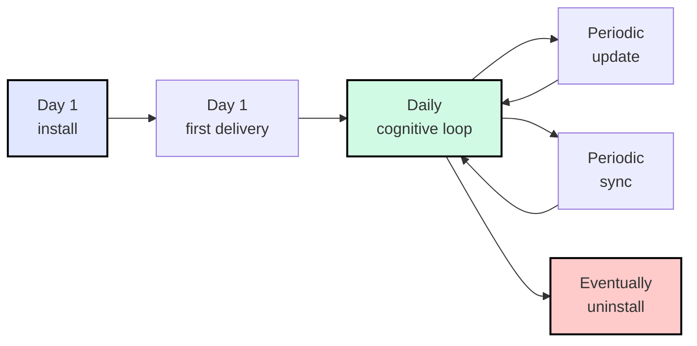

# Install & Boot

Everything you need to get Archon running in your project — and to keep it
healthy through updates, drift checks, and (one day) clean removal.


## TL;DR — one sentence to your AI agent

Open your AI coding assistant in the project and say:

> **read `aaep.site/skill.md` and install archon**

Aliases that work the same way:

> **read `aaep.site/init.md` and install archon** &nbsp;·&nbsp;
> **hi archon, install yourself in this project**

The agent fetches the manifest, asks a few questions, verifies sha256 on every
file, writes the framework, and seeds your runtime ledgers. **Nothing happens
silently** — you confirm the plan first.

That's the entire happy path. The rest of this section is for "what just
happened?", "how do I update?", and "how do I uninstall?".

## Three routes, same destination

Pick whichever fits your situation. All three consume the exact same canonical
manifest at [`aaep.site/manifest.json`](https://aaep.site/manifest.json) and
produce an identical project tree.

| Route | Time | When to use |
|-------|------|-------------|
| **Agent-first** (recommended) | 3 min | You have a frontier coding agent (Cursor, Claude Code, Codex) with web-fetch + write tools. The agent does everything conversationally. |
| **CLI** | 2 min | You're in CI, a script, or you don't have an agent open. Same manifest, same checksums, no conversation. |
| **Manual** | 30 min | You want to understand every file before it lands. Read [Full Setup Guide](/setup/full-guide). |

```bash
# Agent-first: just talk to your agent.
# (no command — the agent runs the protocol from aaep.site/skill.md)

# CLI:
npx @archon/cli@latest install ./my-project
npx @archon/cli@latest install --with=all --yes

# Manual: read /setup/full-guide and follow it page-by-page.
```

## The complete journey

Installing is just step one. Archon is a long-running discipline; here is the
full lifecycle every adopter project goes through:



| Stage | Trigger | Page |
|-------|---------|------|
| **Install** | First time setting up Archon in a project | [/setup/install](/setup/install) |
| **Boot** (first delivery) | Right after install — get a real demand cycle running | [/setup/quickstart](/setup/quickstart) |
| **Daily cognitive loop** | Every demand from now on | [Concepts: 10-Minute Overview](/concepts/overview) |
| **Update** | Archon ships a new version, or you want fresh framework files | [/setup/update](/setup/update) |
| **Sync** | "Is anything drifted?" — read-only health check | [/setup/sync](/setup/sync) |
| **Uninstall** | You're moving off Archon (or testing a clean re-install) | [/setup/uninstall](/setup/uninstall) |

For the full step-by-step end-to-end story, read
[Complete Lifecycle](/setup/lifecycle).

## What you'll have after install

```
your-project/
├── .archon/                      ← framework core + runtime ledgers
│   ├── soul.md                   ← who the agent is (do not edit)
│   ├── manifest.md               ← *your* project hot-context (you edit this)
│   ├── drift.md  debt.md  …      ← runtime ledgers (your governance history)
│   └── VERSION                   ← canonical version pin
├── .cursor/                      ← (or .codex/ / .claude/ for your IDE)
│   ├── commands/archon-*.md      ← /archon, /archon-plan, /archon-review …
│   ├── agents/archon-*.md        ← reviewer, capture-auditor sub-agents
│   ├── rules/archon*.mdc         ← always-on rules
│   └── skills/archon-*/          ← keyword/file-triggered skills
├── docs/archon/                  ← this documentation set (locally)
└── scripts/archon-check.{py,sh,mjs}  ← portable governance gates
```


The split between **framework core** (read-only, owned by Archon) and
**project state** (your own ledgers, owned by you) is the most important
mental model. Updates only touch the former; your governance history is sacred
and never overwritten.

## Mechanical guards out of the box

After install, Archon enforces governance through three mechanical layers:


1. **Pre-commit hook** — `scripts/archon-check.{py,sh,mjs}` blocks commits that
   skip Decision Gate or Close-Out.
2. **Validate gate** — every delivery must pass your project's
   `validate` command (lint + typecheck + test).
3. **Sub-agent review** — capture-auditor and reviewer cross-check every
   delivery before Close-Out.

You wire these in [Quickstart Step 4](/setup/quickstart#step-4-pre-commit-hook).

## Verify after install

```bash
npx @archon/cli@latest doctor
# or, conversationally:
# > hi archon, check yourself
```

Three audit layers report green / yellow / red:

- **L1 Structural** — required files present.
- **L2 Contract** — `scripts/archon-check.py` passes.
- **L3 Hints** — placeholders filled, validate command wired.
- **L4 Canonical diff** — local files match canonical sha256 (added by `sync`).

Green across all four means you are clear to start writing demands.

## Next

- New here? Run the [5-Minute Quickstart](/setup/quickstart).
- Want the whole picture first? Read [Complete Lifecycle](/setup/lifecycle).
- Already installed and curious about a specific operation? Pick a lifecycle
  command from the sidebar (Install / Update / Sync / Uninstall).
