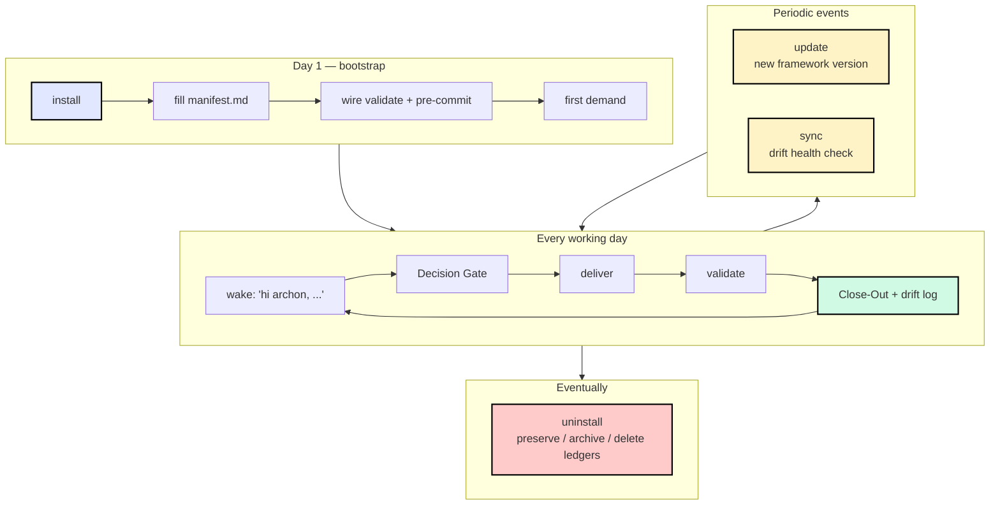
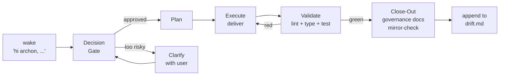

# Complete Lifecycle

The end-to-end story of running Archon in a project — from "I just heard
about this" to "I've been using it for a year" to "I'm moving to something
else." Six stages, each one triggered by something natural in your day.


## The whole picture



## Stage 1 — Install (one-time, ~3 min)

**Trigger**: first time setting up Archon in a fresh or existing project.

**Your local agent has never heard of Archon yet, so the prompt MUST include
a URL** — this is the only way the agent can fetch the protocol:

**You say**: `read aaep.site/skill.md and install archon`
&nbsp;·&nbsp; or, with Node ≥ 18: `npx @archon/cli@latest install`

> Works identically on Cursor, Claude Code, OpenAI Codex CLI, Continue, Aider,
> Windsurf, and any other agent with web-fetch + write tools. The protocol
> auto-detects your IDE and writes bindings to the right directory
> (`.cursor/` / `.claude/` / `.codex/` / etc.). See
> [Quickstart](/setup/quickstart#step-1-install) for per-platform chat-panel
> instructions.

**Agent fetches**: `aaep.site/manifest.json` → every framework file (sha256
verified) → writes `.archon/`, `<binding-root>/`, `scripts/`.

**Outputs**:
- 80+ framework files written (counts depend on optional modules selected).
- 6 empty runtime ledgers seeded — `manifest.md` `drift.md` `debt.md`
  `memos.md` `signs.md` `decisions.md`.
- One log entry in `drift.md` recording the install.

**Reversible?** Yes — see [Stage 6: Uninstall](#stage-6-uninstall-eventually).

→ Full protocol: [/setup/install](/setup/install)

## Stage 2 — Boot (one-time, ~5 min)

**Trigger**: install completed; you want a real demand cycle on record.

**Three concrete acts**, in order:

1. **Fill `.archon/manifest.md`** — Platform paths, Tech Stack, Validation
   Command. Three sections, ~90 s.
2. **Wire the validate command** — confirm `npm run validate` (or your
   equivalent) is green from a clean shell.
3. **Install pre-commit hook** — `python3 scripts/archon-check.py --root .`
   (Python stdlib-only, runs anywhere) as the tripwire. See
   [Quickstart Step 4](/setup/quickstart#step-4) for three wiring options
   (Python `pre-commit`, plain git hook, or husky). Verify with
   `git commit --dry-run`.


**Then run your first demand**: `hi archon, run a plan for X`. Archon walks
the **Cognitive Loop** end-to-end:

```
demand → Decision Gate → plan → deliver → validate → Close-Out → drift log
```

→ Full walk-through: [/setup/quickstart](/setup/quickstart)

## Stage 3 — Daily cognitive loop (every working session)

**Trigger**: any new feature, bugfix, refactor, or piece of work.

**You say**: `hi archon, ...`

> No URL needed — `archon-wake.mdc` (or its platform equivalent for Claude
> Code / Codex / Continue / etc.) loads on every session and recognises the
> `hi archon` wake phrase.

**Archon walks** (every time, no exceptions):



**State that grows over time**:

| File | What grows | When |
|------|-----------|------|
| `.archon/drift.md` | One row per delivery + drift events | Every Close-Out |
| `.archon/debt.md` | Active debt items | When a delivery is gated to ship now and fix later |
| `.archon/memos.md` | Stakeholder vetoes / cross-cutting decisions | When the Decision Gate surfaces something memorable |
| `.archon/signs.md` | Trigger-indexed reasoning capsules | Auditor-promoted patterns from past deliveries |
| `.archon/decisions.md` | ADRs | Each architectural decision |

These five files are **owned by your project**. They are listed under the
manifest's `runtime_ledger_paths` and **never touched by future updates**.

→ Conceptual deep dive: [10-Minute Overview](/concepts/overview)
&nbsp;·&nbsp; [Architecture](/concepts/architecture)

## Stage 4 — Update (periodic, ~2 min)

**Trigger**: Archon ships a new framework version, or you simply want to
confirm you're on the latest.

**You say**: `hi archon, update yourself`
&nbsp;·&nbsp; or, with Node ≥ 18: `npx @archon/cli@latest update`

> URL no longer needed — the wake rule routes `update archon` /
> `hi archon, update yourself` to `aaep.site/update.md` automatically.

**Agent fetches**: latest manifest → builds plan
(**ADD** / **UPDATE** / **UNCHANGED** / **REMOVE**) → asks about optional
modules → fetches diffed files (sha256 verified) → backs up overwritten files
to `.archon-backup-<ISO>/` → writes new versions → bumps `.archon/VERSION`
→ logs the update to `drift.md`.

**What is never touched** — the manifest's `runtime_ledger_paths`:

```
.archon/manifest.md   .archon/drift.md   .archon/debt.md
.archon/memos.md      .archon/signs.md   .archon/decisions.md
.archon/debt/         .archon/drift/     .archon/memos/
.archon/manifest/     .archon/runs/      .archon/dashboard/heartbeats/
.archon/memos-archive/
```

Your governance history is sacred. Updates only refresh framework files.

→ Full protocol: [/setup/update](/setup/update)

## Stage 5 — Sync (periodic, ~10 s)

**Trigger**: "is anything drifted from canonical?" — read-only health check.

**You say**: `hi archon, sync yourself` &nbsp;·&nbsp; `is archon healthy?`
&nbsp;·&nbsp; or, with Node ≥ 18: `npx @archon/cli@latest sync`

**Agent fetches**: latest manifest → walks every Archon-owned path → classifies:

| Label | Meaning |
|-------|---------|
| `ok` | Path in canonical and sha256 matches |
| `modified` | Path in canonical but sha256 differs (you edited a framework file) |
| `missing` | Path in canonical but absent locally |
| `extra` | Path in an Archon-owned dir but not canonical (custom or stale) |
| `ledger` | Listed in `runtime_ledger_paths` — owned by you, never diffed |

**Nothing is written**, except an optional one-line memo if findings are
genuinely interesting.

→ Full protocol: [/setup/sync](/setup/sync)

## Stage 6 — Uninstall (eventually)

**Trigger**: you're moving off Archon, or testing a clean re-install.

**You say**: `hi archon, uninstall yourself`
&nbsp;·&nbsp; or, with Node ≥ 18: `npx @archon/cli@latest uninstall`

**Three explicit choices for your governance ledgers**:

| Mode | What happens to ledgers | Default? |
|------|------------------------|----------|
| **Preserve** (P) | Stay in place under `.archon/` | ✓ default |
| **Archive** (A) | Move to `.archon-history-<ISO>/` then remove from `.archon/` | |
| **Delete** (D) | Wiped permanently — requires typing `DELETE` | |

**Agent fetches**: manifest → builds removal set (canonical files present,
excluding ledgers) → asks one final confirmation → removes files → prunes
empty Archon-owned directories → writes `.archon-uninstall-<ISO>.log` to the
project root.

**Files outside the manifest are never touched.** The agent refuses to delete
anything it cannot prove Archon owns.

→ Full protocol: [/setup/uninstall](/setup/uninstall)

## Lifecycle commands {#lifecycle-commands}

Quick reference card. Each command has both an agent prompt form and a CLI
form — they are **functionally identical**. The CLI is **optional** and
requires Node ≥ 18; the agent path works on any platform.

| Stage | First-time agent prompt (URL required) | After-install agent prompt | Optional CLI (Node ≥ 18) | Page |
|-------|-----------------------------------------|----------------------------|---------------------------|------|
| Install | `read aaep.site/skill.md and install archon` | (covered by install) | `npx @archon/cli@latest install` | [/setup/install](/setup/install) |
| Update | — | `update archon` &nbsp;·&nbsp; `hi archon, update yourself` | `npx @archon/cli@latest update` | [/setup/update](/setup/update) |
| Sync | — | `sync archon` &nbsp;·&nbsp; `is archon healthy?` | `npx @archon/cli@latest sync` | [/setup/sync](/setup/sync) |
| Uninstall | — | `uninstall archon` | `npx @archon/cli@latest uninstall` | [/setup/uninstall](/setup/uninstall) |

## Why this lifecycle is reversible-by-design

Every stage above is **inspectable, reversible, and ledger-preserving** by
default:

- Install is all-or-nothing — no partial installs.
- Update backs up every overwritten file before writing.
- Sync writes nothing (unless you explicitly ask for a memo).
- Uninstall preserves your governance ledgers by default.
- The manifest is a transparent JSON file — no opaque tarball.
- Every fetched file is sha256-verified before being written.

You can leave Archon as easily as you joined. That's intentional: governance
that you cannot exit is not governance, it's lock-in.

## Where to go next

- Just finished installing? [Quickstart Step 2 onward](/setup/quickstart#step-2-fill-in-your-project-manifest-90-s).
- Curious about the manifest schema? [Canonical Manifest](/setup/manifest).
- Want the conceptual model? [10-Minute Overview](/concepts/overview).
- About to update / sync / uninstall? Pick the matching page from the sidebar.
