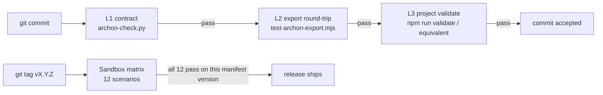

# Testing

Archon is engineered around **mechanical verification, not prose
discipline**. The testing surface ships in **two complementary layers** —
both required for a release to be cut.

| Layer | Asks | Where to start |
|-------|------|----------------|
| **Sandbox Tests** | "Does install / update / sync / uninstall *actually work* on a real fresh project, on this IDE × language combination?" | [Sandbox Overview](/testing/sandbox/) |
| **Contract Tests** | "Are the framework files internally consistent? File shapes, cross-refs, line caps, forbidden substrings, claim verification." | [Test Strategy](/testing/strategy) |

Pick the layer that matches the question you're trying to answer.

## Sandbox Tests — does it work end-to-end?

A reproducible suite that takes one of four clean fixtures
(Node + TS / Python / Go / Rust), runs an Archon lifecycle command
through one of four IDE platforms (Cursor / Claude Code / Codex CLI /
Aider), and verifies the resulting tree against a fixed expected
outcome — with date, manifest version, and result recorded for every run.

**12 scenarios** cover all 5 lifecycle stages × the most common
IDE × language pairings:

- [Sandbox Overview](/testing/sandbox/) — what it is, why it exists, latest run summary.
- [How the Runner Works](/testing/how-runner-works) — runner architecture, local/CI invocation, agent SDK adapter contract.
- [Test Fixtures](/testing/sandbox/fixtures) — the 4 minimal projects each scenario installs into.
- [Test Matrix](/testing/sandbox/test-matrix) — the full 12-scenario grid with status per row.
- [Test Record Template](/testing/sandbox/template) — the shape every new scenario page must follow.

Every scenario page links to a video placeholder (`docs/public/videos/`)
and asciinema placeholder (`docs/public/asciinema/`). Recordings are
uploaded as scenarios reach passing status.

## Contract Tests — are the files internally consistent?

The static gate that runs on every commit. Three sub-layers compose
into a single `validate` chain:

| Sub-layer | What | Where |
|-----------|------|-------|
| **L1 — Portable governance contract** | File shapes · cross-references · line caps · forbidden substrings · Universal Module Guard · Preservation Axis probes | `.archon/contracts/governance-contract.yaml` consumed by `scripts/archon-check.py` (Python stdlib-only) and `scripts/archon-check.sh` (Bash) |
| **L2 — Export manifest round-trip** | Every bundled markdown's referenced images must be listed in the export manifest; platform path rewrite must round-trip | `scripts/test-archon-export.mjs` |
| **L3 — Project validate pipeline** | Adopter-specific lint + typecheck + integration + unit | Adopter's own test harness (e.g., `npm run validate`) |

Pages:

- [Test Strategy](/testing/strategy) — the mental model, gate composition, what is **not** tested mechanically.
- [Representative Samples](/testing/samples) — annotated examples from each gate layer.
- [How to Run in Your Project](/testing/how-to-run) — minimum wiring after `archon init`.

## How the two layers compose



Contract Tests block every commit. Sandbox Tests block every release.
Both must be green.

## The 30-second contract-test summary

```bash
# Layer 1 — portable contract (runs on Python 3 stdlib only)
python3 scripts/archon-check.py --root .

# Layer 2 — export manifest round-trip (only if you ever re-export)
node scripts/test-archon-export.mjs

# Layer 3 — your own project validate pipeline (from manifest.md § Validation Command)
npm run validate    # or python -m pytest, go test, cargo test, etc.
```

`archon doctor` wraps Layer 1 and adds structural + hint layers.
See [CLI](/setup/cli).
