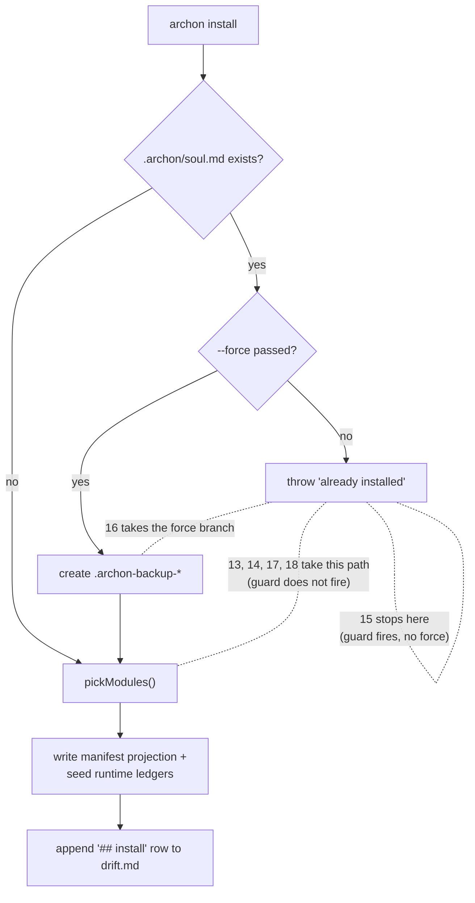

# Install Matrix

Seven scenarios that **bracket the behaviour of `archon install`** on
two axes:

1. **CLI matrix (13–18)** — varying the *initial state of the target
   directory* and the *flags passed to `archon install`*. Drives the
   compiled CLI directly. Deterministic, fast, the green-bar guard for
   the install **implementation**.
2. **Agent matrix (19)** — drives the **same install** through a
   headless Cursor agent reading
   [`https://aaep.site/install.md`](https://aaep.site/install.md), the
   way an end-user actually triggers Archon installation. Probabilistic,
   slower, the guard for the install **agent-facing protocol prose**.

Together they answer:

> What does install do **differently** depending on what it walks
> into, and does the agent-facing install protocol still produce
> a working install?

Read this page top-to-bottom; each row is a real sandbox scenario you
can run on its own with `node scripts/sandbox-run.mjs --only=<test-id>`,
or run the full CLI matrix at once with the
[`sandbox-install-tests` skill](https://github.com/fmw666/archon-protocol/blob/main/.cursor/skills/sandbox-install-tests/SKILL.md)
(`hi archon, run install matrix tests`).

## CLI matrix (13–18)

| # | test-id | Initial state | Flags | Expected | Why it matters |
|---|---------|---------------|-------|----------|----------------|
| 13 | [`install-empty-dir`](./scenarios/install-empty-dir) | bare directory (`fixtures/sandbox-empty`) | `--with=cli` | success; full Archon tree appears; 1 install row | Null reference point: install must work without any host project. |
| 14 | [`install-existing-project`](./scenarios/install-existing-project) | real Node + TS project (`fixtures/sandbox-node-ts`) | `--with=cli` | success; **host files unchanged**; 1 install row | Proves install is purely additive, never mutates host code. |
| 15 | [`install-rejects-reinstall`](./scenarios/install-rejects-reinstall) | already installed | `--with=cli` (no `--force`) | **non-zero exit**; no backup; drift unchanged | The guard rail that prevents accidental clobber. |
| 16 | [`install-force-reinstall`](./scenarios/install-force-reinstall) | already installed | `--with=cli --force` | success; `.archon-backup-*/` created; **2** install rows in drift | Documented escape hatch for re-install / recovery. |
| 17 | [`install-half-archon-dir`](./scenarios/install-half-archon-dir) | `.archon/` exists but **no** `soul.md` | `--with=cli` | success; install proceeds as if clean; sentinel preserved | Locks in the **narrow guard semantics** (it only checks `soul.md`). |
| 18 | [`install-without-cli`](./scenarios/install-without-cli) | bare project | `--without=cli` | success; `tools/archon-cli/` **absent**; required files all there | Module exclusion contract at install time. |

## Agent matrix (19)

| # | test-id | Path | Trigger | Expected | Why it matters |
|---|---------|------|---------|----------|----------------|
| 19 | [`install-agent-cursor`](./scenarios/install-agent-cursor) | Cursor SDK (`@cursor/sdk` `local` mode) | Prompt: *"Read https://aaep.site/install/SKILL.md and install Archon"* | landmark files (`.archon/soul.md`, `.archon/manifest.md`, `.cursor/commands/archon.md`) appear; host `package.json` unchanged | Tests the **agent-facing install prose itself**, not the CLI: if `install.md` is rewritten in a way that confuses agents, this scenario catches it. Records `result: manual` if `CURSOR_API_KEY` is unset (KNOWN-003). |

Why the agent path is its own row, not a `runnable: both` flag on
13 or 14: the runner currently picks **one** adapter per scenario
(`scripts/sandbox-run.mjs::runOneScenario`). Splitting into a sibling
row keeps both layers independently runnable, independently failable,
and independently skippable. The CLI matrix runs on every commit; the
agent matrix runs when an API key is available (typically per-release).

## Mental model: what flips between rows



| Branch | Test ID(s) hitting this branch |
|--------|-------------------------------|
| guard does not fire (target is clean) | 13, 14, 17, 18 |
| guard fires, no force → reject | 15 |
| guard fires, force → backup + re-write | 16 |

Three of the six rows therefore differ **only in module flags**
(13 vs 14 by initial state, 18 by `--without=cli`); the other three
(15, 16, 17) directly probe the install-time guard.

## What stays constant across all six rows

These are the install **invariants** — properties install promises to
preserve regardless of input:

1. **Host project files are never deleted or mutated.**
   Verified explicitly in 14 and 16; implicit in the others (no
   host files exist in 13/17/18 cases beyond what the fixture ships).
2. **`.archon/drift.md` gains exactly one `## install` row per
   successful install** — never zero (silent install) or two
   (double-write). Verified in 13, 14, 16, 17, 18; row count must
   stay at 1 in 15 (rejected install does not write a row).
3. **No `.archon-backup-*` directory unless `--force`.**
   Verified absent in 13, 14, 15, 17, 18; verified present in 16.
4. **`pickModules()` honours `--with=` and `--without=`.**
   Verified in 18; the inverse (default include) is verified in 13
   and 14.

## Initial-state matrix (shown explicitly)

The "initial state" axis matters enough to call out separately:

| Initial state | Used by | Realistic adoption shape |
|---------------|---------|--------------------------|
| **completely empty directory** | 13 | `mkdir my-thing && cd my-thing && hi archon, install yourself` |
| **existing project, no Archon** | 14, 18 | The most common adopter onboarding flow. |
| **existing project, Archon already installed** | 15, 16 | Maintenance — re-installing after a manual `.archon/` edit, version bump that requires reseed, recovery from corruption. |
| **existing project, half-archon dir** | 17 | Aborted install · scaffolding script · manual mkdir. |

Adding more initial states (e.g. *Archon installed with a different
manifest version*, *Archon installed via a different IDE binding*,
*Archon installed as a git submodule*) is cheap once an adopter
reports a real-world case worth locking in.

## How to run them

Single scenario:

```bash
node scripts/sandbox-run.mjs --only=install-empty-dir
```

All six CLI rows at once:

```bash
node scripts/sandbox-run.mjs --only=install-empty-dir,install-existing-project,install-rejects-reinstall,install-force-reinstall,install-half-archon-dir,install-without-cli
```

The full matrix (CLI 13–18 + agent 19) — note the `--runnable=any`
flag, otherwise the runner defaults to `cli` and silently filters out
row 19:

```bash
node scripts/sandbox-run.mjs --runnable=any --only=install-empty-dir,install-existing-project,install-rejects-reinstall,install-force-reinstall,install-half-archon-dir,install-without-cli,install-agent-cursor
```

Or via the matching skill:

```text
hi archon, run install matrix tests
```

(Implemented by [`.cursor/skills/sandbox-install-tests/SKILL.md`](https://github.com/fmw666/archon-protocol/blob/main/.cursor/skills/sandbox-install-tests/SKILL.md).)

The agent matrix (19) is run separately because it requires
`CURSOR_API_KEY` and is non-deterministic:

```bash
CURSOR_API_KEY=… node scripts/sandbox-run.mjs --only=install-agent-cursor --runnable=agent
```

Without the key, the scenario records `result: manual` and the runner
still exits zero — that is the documented `cursor.mjs::isAvailable()`
contract.

## Implementation note: the `__sb-check.cjs` helper

Each scenario's first prerequisite step drops a small helper script
(`__sb-check.cjs`) into the tmp project root. Assertions then call
`node __sb-check.cjs <op> <args...>` (e.g. `drift-install-count 1`,
`has-backup-dir`, `pkg-name-equals acme-todos`) instead of `node -e
"<inline-js>"`. The on-disk approach is **not cosmetic** — when the
sandbox runner spawns `node -e "..."` on Windows, `cmd.exe` shell-quotes
the embedded JS and breaks on operators like `||` or `?:`. Putting the
JS on disk avoids the shell-quoting problem entirely and keeps
assertions cross-platform-safe.

If you add a new install-matrix scenario, copy the helper-writing
prerequisite verbatim from any existing scenario, and extend the
helper's `op` switch if you need a new check. The full op list lives in
the [`sandbox-install-tests` skill](https://github.com/fmw666/archon-protocol/blob/main/.cursor/skills/sandbox-install-tests/SKILL.md#implementation-note-the-__sb-checkcjs-helper).

## Why a separate matrix page

The original [Test Matrix](./test-matrix) is **stage-axis**: install,
boot, update, sync, uninstall — one row per IDE × language combo per
stage. That matrix is the right shape for "did the lifecycle work end-to-end
on this stack?", but it conflates two questions for the install stage:

1. **Does install work on stack X?** (covered by 01–04: each IDE × language pair gets one install scenario)
2. **What does install do across initial-state and flag permutations?** (covered here, 13–18)

Without a dedicated install matrix, question 2 was only implicit
in the prose of `setup/install.md`. By promoting it to a real
sandboxed grid, every claim about install behaviour now has a runnable
proof.

## Cross-references

- [Test Matrix](./test-matrix) — the stage × IDE × language grid.
- [Test Fixtures](./fixtures) — including the new `sandbox-empty`.
- Protocol page: [`/setup/install`](/setup/install)
- Source: [`docs/source-files/tools/archon-cli/lib/install.mjs`](https://github.com/fmw666/archon-protocol/blob/main/docs/source-files/tools/archon-cli/lib/install.mjs)
- Skill: [`sandbox-install-tests`](https://github.com/fmw666/archon-protocol/blob/main/.cursor/skills/sandbox-install-tests/SKILL.md)
