# Test Matrix

The complete grid of sandbox scenarios. Every row links to a full
[`template.md`](./template)-shaped scenario page with steps,
expected outcome, and run records.

## The grid

| # | test-id | Stage | IDE | Language | Fixture | Status |
|---|---------|:-----:|-----|----------|---------|:------:|
| 01 | [`install-cursor-node`](./scenarios/install-cursor-node) | install | Cursor | Node 20 + TS | sandbox-node-ts | ⏳ |
| 02 | [`install-claude-python`](./scenarios/install-claude-python) | install | Claude Code | Python 3.12 | sandbox-python | ⏳ |
| 03 | [`install-codex-go`](./scenarios/install-codex-go) | install | Codex CLI | Go 1.22 | sandbox-go | ⏳ |
| 04 | [`install-aider-rust`](./scenarios/install-aider-rust) | install | Aider | Rust 1.78 | sandbox-rust | ⏳ |
| 05 | [`boot-cursor-node`](./scenarios/boot-cursor-node) | boot (first demand) | Cursor | Node 20 + TS | sandbox-node-ts (after 01) | ⏳ |
| 06 | [`boot-claude-python`](./scenarios/boot-claude-python) | boot (first demand) | Claude Code | Python 3.12 | sandbox-python (after 02) | ⏳ |
| 07 | [`update-cursor-node`](./scenarios/update-cursor-node) | update (v0.1.0 → v0.1.1) | Cursor | Node 20 + TS | sandbox-node-ts (after 01) | ⏳ |
| 08 | [`update-cli-without-cli`](./scenarios/update-cli-without-cli) | update with `--without=cli` | Cursor | Node 20 + TS | sandbox-node-ts (after 01) | ⏳ |
| 09 | [`sync-clean`](./scenarios/sync-clean) | sync (no drift expected) | Cursor | Node 20 + TS | sandbox-node-ts (after 01) | ⏳ |
| 10 | [`sync-modified`](./scenarios/sync-modified) | sync (drift detected) | Cursor | Node 20 + TS | sandbox-node-ts (after 01, hand-edit injected) | ⏳ |
| 11 | [`uninstall-preserve`](./scenarios/uninstall-preserve) | uninstall (preserve ledgers) | Claude Code | Python 3.12 | sandbox-python (after 02) | ⏳ |
| 12 | [`uninstall-archive`](./scenarios/uninstall-archive) | uninstall (archive ledgers) | Cursor | Node 20 + TS | sandbox-node-ts (after 01) | ⏳ |
| 13 | [`install-empty-dir`](./scenarios/install-empty-dir) | install (empty dir) | Cursor | (none) | sandbox-empty | ⏳ |
| 14 | [`install-existing-project`](./scenarios/install-existing-project) | install (host preserved) | Cursor | Node 20 + TS | sandbox-node-ts | ⏳ |
| 15 | [`install-rejects-reinstall`](./scenarios/install-rejects-reinstall) | install (negative — refuse re-install) | Cursor | Node 20 + TS | sandbox-node-ts (after first install) | ⏳ |
| 16 | [`install-force-reinstall`](./scenarios/install-force-reinstall) | install (`--force`) | Cursor | Node 20 + TS | sandbox-node-ts (after first install) | ⏳ |
| 17 | [`install-half-archon-dir`](./scenarios/install-half-archon-dir) | install (edge case — bare `.archon/`) | Cursor | Node 20 + TS | sandbox-node-ts + sentinel | ⏳ |
| 18 | [`install-without-cli`](./scenarios/install-without-cli) | install (`--without=cli`) | Cursor | Node 20 + TS | sandbox-node-ts | ⏳ |
| 19 | [`install-agent-cursor`](./scenarios/install-agent-cursor) | install (agent path via `install.md`) | Cursor (`@cursor/sdk`) | Node 20 + TS | sandbox-node-ts | ⏳ |

> Rows 13–18 form the **CLI install matrix**, row 19 is the **agent
> install matrix**. Both belong to the unified
> **[Install Matrix](./install-matrix)** page, which characterises every
> meaningful branch in `archon install` along two dimensions:
> *initial-state × flags* (CLI) and *agent-facing protocol prose*
> (agent). See the matrix page for the mental-model graph and run
> commands.

> **Status legend**: ✅ passing · ❌ failing · ⏳ pending.
> Status is updated **per release**: each scenario must pass against
> the candidate manifest version before the framework is tagged.

## Coverage view

### By stage

| Stage | # of scenarios | Test IDs |
|-------|:-------------:|----------|
| install | 4 | 01–04 |
| install matrix — CLI (state × flags) | 6 | 13–18 |
| install matrix — agent (`install.md`) | 1 | 19 |
| boot | 2 | 05, 06 |
| update | 2 | 07, 08 |
| sync | 2 | 09, 10 |
| uninstall | 2 | 11, 12 |
| **Total** | **19** | |

### By IDE

| IDE | # of scenarios | Test IDs |
|-----|:-------------:|----------|
| Cursor | 14 | 01, 05, 07, 08, 09, 10, 12, 13, 14, 15, 16, 17, 18, 19 |
| Claude Code | 3 | 02, 06, 11 |
| OpenAI Codex CLI | 1 | 03 |
| Aider | 1 | 04 |
| Continue / Windsurf | 0 | (deferred — see [KNOWN-ISSUES.md](https://github.com/fmw666/archon-protocol/blob/main/KNOWN-ISSUES.md)) |

### By language

| Language | # of scenarios | Test IDs |
|----------|:-------------:|----------|
| Node + TypeScript | 13 | 01, 05, 07, 08, 09, 10, 12, 14, 15, 16, 17, 18, 19 |
| Python | 3 | 02, 06, 11 |
| Go | 1 | 03 |
| Rust | 1 | 04 |
| (none — bare directory) | 1 | 13 |

## Dependency graph

Some scenarios reuse the post-install state of an earlier scenario.
Run them in this order if you want to chain (otherwise each scenario
sets itself up from the fixture):

```mermaid
graph TD
  F1[fixtures/sandbox-node-ts] --> S01[01 install-cursor-node]
  S01 --> S05[05 boot-cursor-node]
  S01 --> S07[07 update-cursor-node]
  S01 --> S08[08 update-cli-without-cli]
  S01 --> S09[09 sync-clean]
  S01 --> S10[10 sync-modified]
  S01 --> S12[12 uninstall-archive]

  F1 --> S14[14 install-existing-project]
  F1 --> S18[18 install-without-cli]
  F1 --> S19[19 install-agent-cursor]
  S14 --> S15[15 install-rejects-reinstall]
  S14 --> S16[16 install-force-reinstall]
  F1 --> S17[17 install-half-archon-dir]

  F2[fixtures/sandbox-python] --> S02[02 install-claude-python]
  S02 --> S06[06 boot-claude-python]
  S02 --> S11[11 uninstall-preserve]

  F3[fixtures/sandbox-go] --> S03[03 install-codex-go]
  F4[fixtures/sandbox-rust] --> S04[04 install-aider-rust]
  F5[fixtures/sandbox-empty] --> S13[13 install-empty-dir]
```

## What this matrix does **not** cover (yet)

| Gap | Why deferred | Trigger to add |
|-----|--------------|----------------|
| Continue / Windsurf IDE coverage | No active adopter; would be a synthetic test | First adopter on either IDE |
| Java / Kotlin / Swift / C++ fixtures | See [`fixtures/README.md`](https://github.com/fmw666/archon-protocol/blob/main/fixtures/README.md) | First adopter |
| `archon doctor` deep-dive scenario | Doctor is a wrapper over check + structural; covered transitively in 09 | Behavior diverges from `sync` |
| Multi-agent / parallel-write race | Single-agent invariant is part of soul.md; race testing is out of scope | If invariant is relaxed |
| Cross-OS matrix (Linux × macOS × Windows × WSL) | First-party CI runs on Linux; macOS/Windows runs are spot-checked manually | Before declaring `1.0.0` |

These gaps are recorded so the matrix is honest about what
"sandbox-tested" means today.
