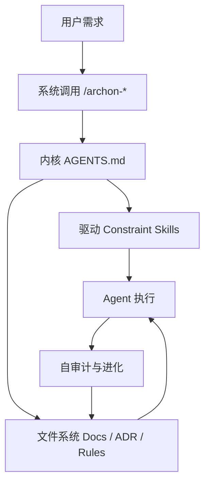

# AAEP 操作系统模型

> 第 1 话：为什么一个 AI Agent 需要“操作系统”？

## 角色登场

  <section class="comic-card">
    User
    
“我不只是想让你写代码，我希望你记住项目规则、遵守架构边界，并且越做越懂这个系统。”

  </section>
  <section class="comic-card">
    Agent
    
“如果每次都从零开始，我只能靠上下文临时发挥。需要一个常驻的运行规则。”

  </section>
  <section class="comic-card">
    Kernel
    
“我来负责身份、流程和约束。所有工作先过内核，再调用对应能力。”

  </section>

## 分镜一：没有操作系统时

AI 工具本身有很强的执行能力，但如果缺少协议层，常见问题会反复出现：

- 每次会话都要重新解释项目约定。
- 架构约束靠口头提醒，容易被遗忘。
- 经验无法沉淀为下一次任务的默认行为。
- 审计、测试、文档更新经常变成事后补救。

## 分镜二：AAEP 把能力组织成 OS

这张图里，每一层都有明确职责：

| 层级 | 漫画角色 | 作用 |
|------|----------|------|
| Kernel | 指挥官 | 常驻上下文，决定身份、流程和质量标准 |
| Drivers | 规则卡 | 把禁止项、边界和工程规范注入执行过程 |
| Syscalls | 指令按钮 | 用 `/archon-*` 命令触发标准工作流 |
| Filesystem | 记忆库 | 保存架构文档、ADR、规则和经验 |
| Daemons | 后台检查员 | 做审计、测试、链接检查等守护任务 |

## 分镜三：一次任务如何流动

  <section class="comic-card">
    1. boot
    
Agent 读取内核和约束，确认自己应该怎么工作。

  </section>
  <section class="comic-card">
    2. exec
    
系统调用触发交付流程，需求被拆成可验证的步骤。

  </section>
  <section class="comic-card">
    3. stat
    
自审计检查代码、测试、文档和边界是否一致。

  </section>
  <section class="comic-card">
    4. evolve
    
新发现的问题沉淀为规则或文档，让下一次默认更好。

  </section>

## 记住这一页

AAEP 不是把 AI 工具变得更“会写代码”，而是给它一套稳定的运行环境：让规则常驻、流程可重复、经验可积累。

下一篇可以继续画：**一个约束如何从“口头经验”进化成“驱动规则”**。
