# 全旅途与时序链路

> Archon 的**运行时**地图：一次会话可能走的每一条路径，按序排列，标注每一步由哪个文件定义、以及该步是**机械闸门**（run-state 行 / 契约条款 / 测试）还是**纯散文**。这是回答「业务可控、没偏差吗？」的参考——配合 [架构参考](/zh/concepts/architecture)（结构）与 [五大支柱](/zh/concepts/five-pillars)（为什么）一起读。
>
> 与 [用户旅程](/zh/concepts/user-journeys)（把 16 个*陷阱*映射到捕捉它们的机制）不同，本页映射的是*控制流*本身。
>
> 每条旅途都配了图；用于**业务追踪与维护**的横切视图——安装、更新/同步、drift 状态机、记录数据流、演进双动作——汇总在下方 §7 业务追踪与维护图表包。

下文所有路径都是同一个认知循环——`Perceive → Model → Act → Verify`（可回溯）——戴着三顶不同的帽子。帽子是唤醒模式；循环不变。

| 唤醒模式 | 命令 | 目的 | 加载的 soul 扩展 |
|---------|------|------|-----------------|
| **Plan** | [`/archon-plan`](/source/commands/archon-plan) | 谈*做什么* /*多大* /*多大风险* | `soul/review.md` |
| **Demand** | [`/archon-demand`](/source/commands/archon-demand) | 端到端执行一次有边界的交付 | `soul/delivery.md` |
| **Review** | [`/archon-review`](/source/commands/archon-review) | drift 压力越阈时的独立全量复查 | `soul/review.md` |

---

## 0. 唤醒与路由

来源：[`archon-wake.mdc`](/source/rules/archon-wake) · [`archon.md`](/source/commands/archon)。

| # | 步骤 | 定义于 | 闸门 |
|---|------|--------|------|
| 0.1 | 加载框架 primer（仅本会话首次唤醒） | `archon-framework/SKILL.md` | 机械（一次） |
| 0.2 | 热路径读 soul（仅身份/路由节） | `soul.md` §Core Axioms · §Ownership · §Cognitive Loop · §Autonomy | 机械 |
| 0.3 | 热路径读 manifest（当前状态、词表、ULI、validation 命令） | `manifest.md`（分节作用域） | 机械 |
| 0.4 | **Drift 预检（硬闸门）** | `archon.md` §Step 0 | **硬闸门** |
| 0.5 | 路由到 plan / demand / review（显式前缀或推断） | `archon.md` §Routing | 机械 |

**Drift 预检**是主安全联锁（阈值取自 [`governance-contract.yaml`](/source/contracts/governance-contract) `drift_gate`）：

- `drift ≥ 20`（emergency）→ **停止一切 demand 接入**，强制 review。
- `drift ≥ 12`（full）→ **阻断 demand**，仅允许 review。
- `drift ≥ 6`（light）→ 建议：在下一个 medium/large demand 前插入一次 light review。

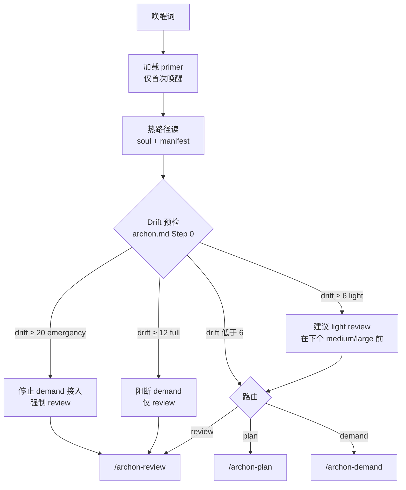

> 为什么是硬闸门而非散文：历史上 drift 曾达到 full 阈值的 108% 而 demand 仍在执行。ADR-9 把预检从 L3 散文提升为 L1 测试。见 [漂移机制](/zh/concepts/drift-mechanism)。

## 1. Plan 旅途

来源：[`archon-plan.md`](/source/commands/archon-plan)（加载 `soul/review.md`）。

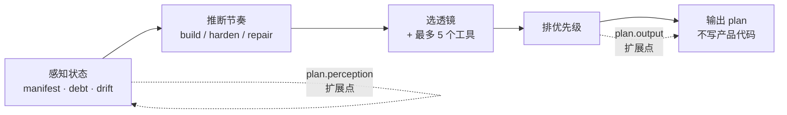

1. **状态感知**——读 manifest、`debt.md`、`drift.md`。*(扩展点：`plan.perception`)*
2. **节奏推断**——从状态信号推导 build / harden / repair 偏向，**而非** mode flag（soul §Evolution Tempo）：里程碑早期 → build；闸门失败 → harden；债务临期 → repair；最近 5 条 drift 有 ≥3 条同类 → 停滞。
3. **领域透镜 + 工具选择**——在 load budget 内选 ≤5（建议 3）个推理工具（[`domain-lenses/registry.yaml`](/source/domain-lenses/registry)）。
4. **优先级排序 → 输出。** *(扩展点：`plan.output`)*

Plan 只谈判，不写产品代码——那是 demand 旅途的活。

## 2. Demand 旅途（核心生命周期）

来源：[`archon-demand.md`](/source/commands/archon-demand)（加载 `soul/delivery.md`）。run-state 行取自 [`run.template.md`](/source/runtime-templates/run.template)。

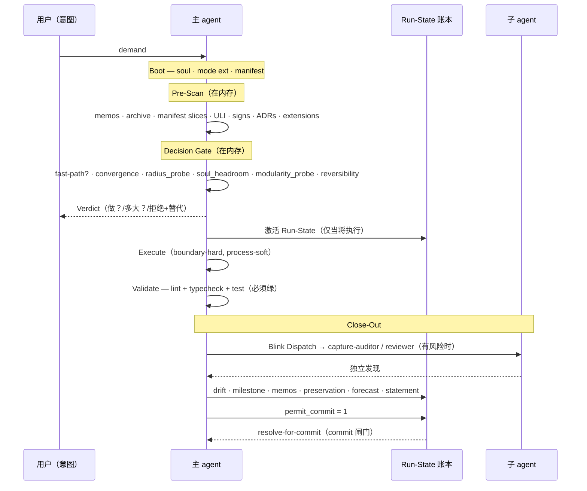

**Run-State 懒激活**（`archon-demand.md` §Run-State Lazy Activation）：Pre-Scan 与 Decision Gate 在*内存*里跑，让被拒或极小的 demand 快速回答；Run-State 仅在 Verdict 之后、且交付将执行 / 需拒绝证据 / 将提交时才写盘。

### 有序步骤 + 其 run-state 检查点

| 阶段 | 步骤 | run-state key | 闸门 |
|------|------|---------------|------|
| Boot | soul / mode-ext / manifest 已加载 | `boot.soul_loaded` · `boot.mode_extension_loaded` · `boot.manifest_loaded` | 机械 |
| Pre-Scan | memos 扫描 | `prescan.memos_scanned` | soul 强制 |
| Pre-Scan | archive 召回（关键词匹配） | `prescan.archive_scanned` | 可 smart-skip |
| Pre-Scan | **manifest 切片扫描**（ADR-32，存在 `slices/` 时） | 折入 manifest 加载 | 条件 |
| Pre-Scan | 用户语言别名扫描 · signs sweep | — | 机械 sweep |
| Pre-Scan | ADR 索引扫描 · 扩展 `demand.pre-scan` hook | `prescan.adrs_scanned` · `prescan.extensions_hooked` | 机械 |
| Decision | fast-path 评估 | `decision.fastpath_assessed` | 机械 |
| Decision | convergence 分类（manifest 声明 scope 时） | `decision.convergence_classified` | **闸门**（ADR-12） |
| Decision | `radius_probe:` · `soul_headroom:` · `modularity_probe:`（slice-aware） | — | 机械探针 |
| Decision | plan-mode 绑定 · **Verdict**（+ `Borrowed concepts (if any):` · `Override (if any):`） | `decision.plan_mode_declared` · `decision.verdict_output` | **硬闸门**（ADR-11） |
| Execute | 自主执行内部（boundary-hard, process-soft） | `execute.changes_applied` | 有改动则 soul 强制 |
| Validate | lint + typecheck + test 绿 | `validate.validation_green` | **硬闸门**（代码改动时绝不可用户跳过） |
| Close-Out | manifest + 切片同步 | `closeout.manifest_synced` | soul 强制 |
| Close-Out | Blink Dispatch → 子 agent | `closeout.subagent_dispatched` | 闸门（高风险禁跳） |
| Close-Out | capture-auditor 运行/处理 | `closeout.auditor_ran` · `closeout.auditor_processed` | 可 smart-skip |
| Close-Out | drift 更新 | `closeout.drift_updated` | soul 强制 |
| Close-Out | 里程碑闸门 · memos 追加 · 扩展 | `closeout.milestone_gate` · `closeout.memos_appended` · `closeout.extensions_hooked` | 可 smart-skip |
| Close-Out | preservation pass · acceptance-delta · numeric 交叉核 · governance-docs mirror · architecture forecast · **Final Imperative** | （折入） | 机械自检 |
| Close-Out | statement 输出 | `closeout.statement_output` | soul 强制 |
| Git | `permit_commit: 1` → `resolve-for-commit` | `permit_commit` | **commit 闸门** |

**Verdict** 是枢轴：它在*任何 write-side 工具调用之前*产出（ADR-11，契约 pin）。**Validation Gate** 与 **Close-Out** 是其后的两个硬检查点——在 `validate.validation_green` 为 `1` 且 `permit_commit` 置位前，没有任何东西能到达 commit；这由 [`archon-run-state.mjs resolve-for-commit`](/source/scripts/archon-run-state) 校验。

## 3. Review 旅途

来源：[`archon-review.md`](/source/commands/archon-review)（加载 `soul/review.md`）。三级（阈值在 `drift_gate`）：

| 级别 | 触发 | 运行内容 | 重置 |
|------|------|---------|------|
| **Light** | drift ≥ 6 | 仅机械健康审计（≤full 成本的 10%） | 释放 2–4 分 |
| **Full** | drift ≥ 12 | 独立 **reviewer** 子 agent + 四阶段审计 | 重置到 0–3 |
| **Emergency** | drift ≥ 20 | 停止 demand 接入 + 盲点根因 + 强制整改 | 重置 |

护栏：**「Light cannot satisfy a Full-threshold crossing」**（同时 pin 在 `soul/review.md` 与 `archon-review.md`）——light pass 不能用来清除一个本该 full review 的 drift 等级。

drift 计数器就是驱动评审节奏的状态机（阈值按项目阶段动态变化——见 [漂移机制](/zh/concepts/drift-mechanism)）：

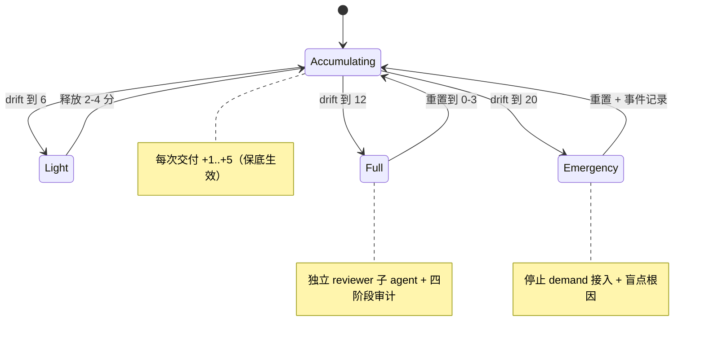

## 4. run-state 账本（脊柱）

[`run.template.md`](/source/runtime-templates/run.template) + `run-state.schema.json` 是一次交付的机器可读轨迹。22 个状态 key，各为 `0`（待办）/ `1`（完成）/ `skip:<reason>` / `2`（用户意图 smart-skip，ADR-15）。仅六行可 smart-skip（`prescan.archive_scanned`、两个 auditor 行、`memos_appended`、`milestone_gate`、`extensions_hooked`）；其余 soul 强制。`permit_commit: 1` 是最终闸门，被 pre-commit hook 与 `archon-git-commit` 技能检查。

追踪者盯的阶段推进——每次转移翻动 run-state 行；闸门未过则 commit 不可达：

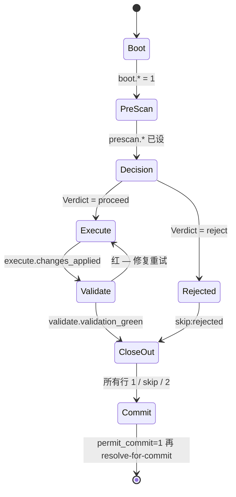

这正是生命周期*可审计*的原因：一次交付无法悄悄跳过承重步骤——被跳过的行可见，且 `resolve-for-commit` 会阻断提交。

## 5. 子 agent 调度（独立性层）

来源：[`blink-dispatch/SKILL.md`](/source/skills/blink-dispatch) + [`archon-reviewer`](/source/agents/archon-reviewer) / [`archon-capture-auditor`](/source/agents/archon-capture-auditor)。

Close-Out 时 **Blink Dispatch** 对完成的 diff 做薄切片，输出 `subagent_dispatch: skip:<reason> | use:<subagent>:<reason>`。高风险路径（scripts、contracts、soul、commands、agents——`blink_dispatch.high_risk_path_patterns`）**禁止跳过**。两个子 agent 都应跑在与主 agent *不同的模型家族*上（soul §Sub-Agent Independence）以对抗沉没成本偏见：

- **reviewer**——周期级，在 full-review 阈值触发。
- **capture-auditor**——每交付级，当 Blink 检测到实现 / 治理 / 边界 / 修复 / 状态闭合 / 不确定性风险时触发。

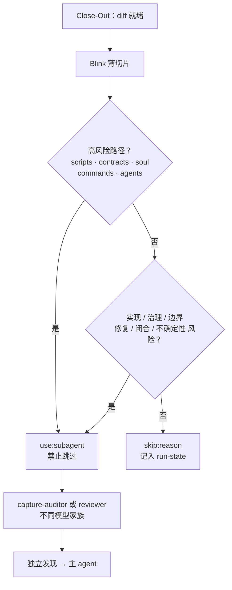

## 6. v0.2.0 机制落在哪

[ADR-31 / ADR-32](/zh/concepts/decisions) 的记忆升级接入既有槽位——无新 run-state key、无新 Verdict token：

- **接管期自扫描**（ADR-31）是*安装期*步骤（`install.md` §7b），在任何唤醒之前——它自举出 manifest，供唤醒步骤读取。
- **manifest 切片扫描**（ADR-32）是*pre-scan*步骤（见上表）：命中的切片按需加载，折入同样的 `manifest_loaded` / `manifest_synced` 检查点。缺 `.archon/manifest/slices/` = 单作用域，所以不用此特性的项目链路不变。

## 7. 业务追踪与维护图表包

维护者或审计者需要的横切视图——它们跨会话，而非活在单次唤醒里。

### 7.1 安装 / 接管（一次性）

来源：[`install.md`](https://aaep.site/install.md) · [`skill.md`](https://aaep.site/skill.md)。v0.2.0 的新增（模板播种 + 自扫描）是 Step 7 与 7b。

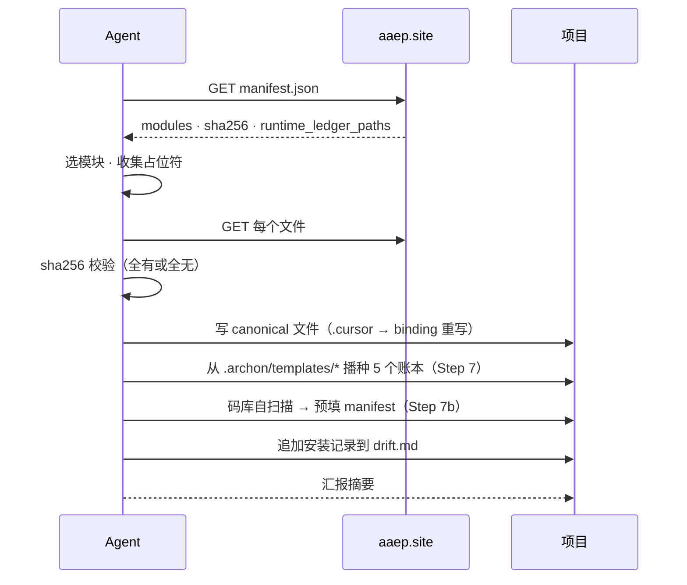

### 7.2 Update vs Sync——以及什么不动

维护不变量：框架文件可替换，**runtime 账本归 adopter 所有、绝不覆盖**（`manifest.runtime_ledger_paths`）。

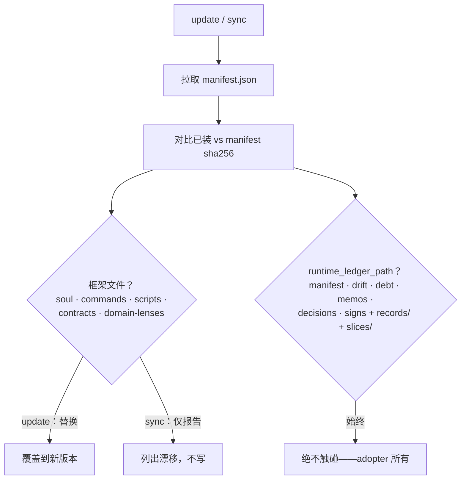

### 7.3 状态文件数据流（记录 → 热摘要 → 归档）

按 ADR-22——每个 drift / memos / debt 数字背后的事件溯源链，也是业务追踪的审计链。

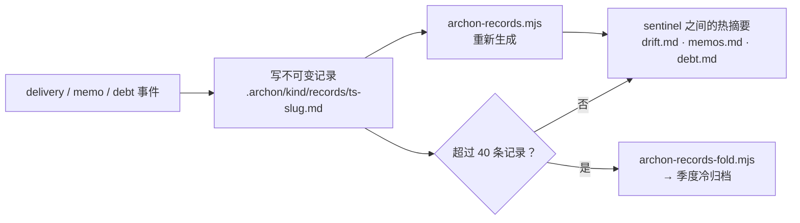

### 7.4 知识演进——Close-Out 的双动作

来源：`soul.md` §Evolution。每次交付都回答两个问题；preservation 答案被机械校验（`archon-claim-verifier --mode=preservation`）。

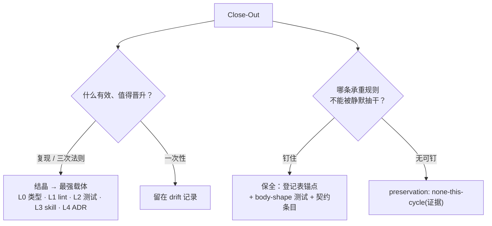

### 7.5 manifest 切片加载（ADR-32，仅大型 / monorepo）

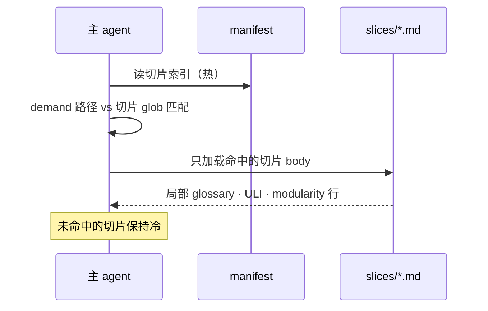

## 8. 为什么它保持可控

上面每个承重步骤都被锚定在最低可强制层（[约束金字塔](/zh/concepts/five-pillars)）：硬闸门（drift 预检、Verdict 先于写、validation 绿、permit_commit）失败即阻断；run-state 账本让每次跳过可见；契约的 `critical_rule_substrings` 钉住锚点，使后续编辑无法静默抽干它们。偏差不是靠信任来防止的——是靠那道阻断提交的闸门防止的。
