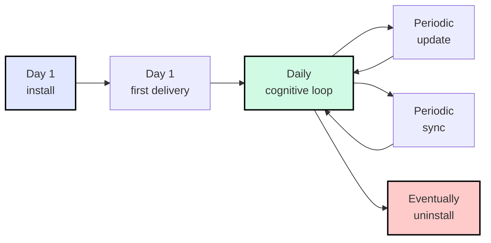

# 安装与启动

让 Archon 在你的项目里跑起来所需的一切 —— 以及在更新、漂移检查、（未来的）干净卸载中保持健康。


## TL;DR —— 给 AI 代理的一句话（首次）

第一次时，本地 AI 代理完全不知道 Archon 是什么。所以你的**引导提示必须包含一个 URL**，代理才能去拉协议：

> **read `aaep.site/skill.md` and install archon**

等价的引导别名：

> **read `aaep.site/init.md` and install archon** &nbsp;·&nbsp;
> **fetch `aaep.site/skill.md`, then install archon in this project**

安装之后，`archon-wake.mdc`（或其平台等价物 —— 见下文 [多平台代理支持](#multi-platform-agent-support)）会在每次会话加载，所以后续命令不再需要 URL —— *"hi archon, update yourself"*、*"sync archon"*、*"is archon healthy?"* 都能正确路由。

代理拉取 manifest，问几个问题，对每个文件校验 sha256，写入框架，并初始化你的 runtime 账本。**没有任何静默动作** —— 你先确认计划。

这就是完整的 happy path。本节剩下的部分用来回答「刚刚发生了什么？」「我怎么 update？」「我怎么 uninstall？」。

## 多平台代理支持 {#multi-platform-agent-support}

Archon 是**平台中立的**。`.archon/` 下的框架核心无论你用哪个 AI 编码 IDE 都一样；只有**绑定目录**（rules / agents / commands / skills）不同。任何具备 web-fetch + 文件写入工具的编码代理都可以跑安装协议 —— 代理读 [`aaep.site/skill.md`](https://aaep.site/skill.md) §3，检测你的平台，然后把绑定写到正确位置。

| IDE / 代理 | 绑定根 | 引导提示 |
|-------------|--------------|------------------|
| **Cursor** | `.cursor/` | `read aaep.site/skill.md and install archon` |
| **Claude Code** | `.claude/` | `read aaep.site/skill.md and install archon` |
| **OpenAI Codex CLI** | `.codex/`（或根 `AGENTS.md`） | `read aaep.site/skill.md and install archon` |
| **Continue** | `.continue/` | `read aaep.site/skill.md and install archon` |
| **Aider** | `.aider/` | `read aaep.site/skill.md and install archon` |
| **Windsurf** | `.windsurf/` | `read aaep.site/skill.md and install archon` |
| **其他**（裸 API 客户端、自定义 harness 等） | （默认 `.cursor/`，请代理确认） | `fetch aaep.site/skill.md and follow §3 to detect my IDE` |

所有人同一条提示 —— 平台检测交给协议。每个 IDE「打开聊天面板，粘贴这条」的逐步走查在 [5 分钟快速开始](/zh/setup/quickstart)。

## 三条路线，同一目的地

挑最适合你处境的一条。三条都消费同一份规范 manifest（[`aaep.site/manifest.json`](https://aaep.site/manifest.json)），产出完全相同的项目目录树。

| 路线 | 时长 | 适用场景 | 需要的运行时 |
|-------|------|-------------|----------------|
| **Agent-first**（推荐） | 3 分钟 | 你有一个具备 web-fetch + 写入工具的前沿编码代理（上述任一平台）。代理通过对话搞定一切。 | 无 —— 代理平台负责 fetch + 写入 |
| **CLI** | 2 分钟 | 你在 CI、脚本里，或没开代理。同一份 manifest、同样的 checksum、不走对话。 | Node ≥ 18（CLI 是 JS 实现的） |
| **Manual** | 30 分钟 | 你想在每个文件落地之前都看明白。读 [完整安装指南](/zh/setup/full-guide)。 | 无 |

```bash
# Agent-first：直接和代理对话（代理会从
# aaep.site/skill.md 跑协议 —— 不需要 shell 命令）。

# CLI（仅当你有 Node ≥ 18）：
npx @archon/cli@latest install ./my-project
npx @archon/cli@latest install --with=all --yes

# Manual：读 /zh/setup/full-guide，逐页跟做。
```

> **Archon 本身不要求 Node.js。**框架核心是纯 markdown + 一个 Python 契约检查器（`scripts/archon-check.py`，仅依赖 stdlib）。只有当你启用可选的 **CLI** 或 **dashboard** 模块时才需要 Node。见下文 [项目语言影响](#project-language-impact)。

## 完整旅程

安装只是第一步。Archon 是一项长期纪律；以下是每个采用方项目都会经历的完整生命周期：



| 阶段 | 首次提示（需要 URL） | 安装后提示（URL 可选） | 页面 |
|-------|-----------------------------------|--------------------------------------|------|
| **Install** | `read aaep.site/skill.md and install archon` | — | [/zh/setup/install](/zh/setup/install) |
| **Boot**（首次 delivery） | （由 install 涵盖） | `hi archon, plan a feature for X` | [/zh/setup/quickstart](/zh/setup/quickstart) |
| **每日 cognitive loop** | — | `hi archon, demand: <one-liner>` | [概念：10 分钟速览](/zh/concepts/overview) |
| **Update** | — | `hi archon, update yourself` | [/zh/setup/update](/zh/setup/update) |
| **Sync** | — | `is archon healthy?` &nbsp;·&nbsp; `sync archon` | [/zh/setup/sync](/zh/setup/sync) |
| **Uninstall** | — | `uninstall archon` &nbsp;·&nbsp; `remove archon` | [/zh/setup/uninstall](/zh/setup/uninstall) |

完整的端到端逐步故事见 [完整生命周期](/zh/setup/lifecycle)。

## 安装后你将拥有什么

```
your-project/
├── .archon/                      ← 框架核心 + runtime 账本
│   ├── soul.md                   ← 代理是谁（不要编辑）
│   ├── manifest.md               ← *你的*项目热上下文（你编辑这个）
│   ├── drift.md  debt.md  …      ← runtime 账本（你的治理史）
│   └── VERSION                   ← 规范版本钉子
├── <BINDING_ROOT>/               ← .cursor/ · .claude/ · .codex/ · …
│   ├── commands/archon-*.md      ← /archon、/archon-plan、/archon-review …
│   ├── agents/archon-*.md        ← reviewer、capture-auditor 子代理
│   ├── rules/archon*.mdc         ← 常驻规则（每次会话加载）
│   └── skills/archon-*/          ← 关键词/文件触发的 skills
└── scripts/
    ├── archon-check.py           ← 可移植契约检查器（Python stdlib）
    └── archon-check.sh           ← Bash 包装（委派给 .py）
```


**框架核心**（只读、归 Archon 所有）和**项目状态**（你自己的账本、归你所有）的切分是最重要的心智模型。更新只动前者；你的治理史是神圣的，永不被覆盖。

## 项目语言影响 {#project-language-impact}

Archon 是**语言无关的**。契约检查器是 Python（仅 stdlib，凡能跑 Python 3 的地方都能跑），所以一个 Go / Rust / Java / iOS / Android 项目可以采用 Archon 而无需碰任何 JavaScript 或 TypeScript。

每个项目会变化的部分：

| 关切点 | Archon 如何适配 |
|---------|---------------------|
| Pre-commit hook | 代理根据你的开发环境（不是项目主语言）选 `python3 scripts/archon-check.py`、`sh scripts/archon-check.sh` 或 `py -3 scripts\archon-check.py`（Windows）。 |
| 测试面 | Archon 的治理契约约束结构 —— `governance-contract.yaml` 由 `archon-check.py` 消费。你的**项目测试**留在项目原生测试框架（pytest、go test、jest、JUnit、XCTest 等）。Archon 不强加测试框架。 |
| `validate` 命令 | 由你定义你项目的 "validate" 是什么 —— `npm run validate`、`make validate`、`cargo test`、`pytest`、`mvn verify` 等。Archon 只要求存在某个 `validate` 命令并接入 cognitive loop。 |
| 可选 CLI | 没有 Node ≥ 18 就跳过。代理路径覆盖 CLI 能做的一切。 |

## 开箱即用的机械守卫

安装之后，Archon 通过三层机械手段执行治理：


1. **Pre-commit hook** —— `scripts/archon-check.py`（或其 `.sh` 包装）阻止跳过 Decision Gate 或 Close-Out 的提交。代理在 [Install Step 8](/zh/setup/install#step-8-wire-the-pre-commit-hook) 中根据你的开发环境接入相应的 hook 命令。
2. **Validate gate** —— 每次 delivery 必须通过你项目自己的 `validate` 命令（在你项目的技术栈里跑 lint + typecheck + test）。
3. **子代理审阅** —— capture-auditor 与 reviewer 在 Close-Out 之前对每次 delivery 交叉核对。

## 安装后验证

安装之后，代理在下一次会话的第一个动作是 wake 并跑一次自检：

> `is archon healthy?` &nbsp;·&nbsp; `sync archon`

或者，使用可选的 CLI：

```bash
npx @archon/cli@latest doctor   # 需要 Node ≥ 18
```

三层审计报 green / yellow / red：

- **L1 结构** —— 必需文件存在。
- **L2 契约** —— `scripts/archon-check.py` 通过。
- **L3 提示** —— 占位符已填、validate 命令已接入。
- **L4 规范 diff** —— 本地文件与规范 sha256 一致（由 `sync` 添加）。

四层全绿，你就可以开始写需求了。

## 接下来

- 第一次来？跑 [5 分钟快速开始](/zh/setup/quickstart)。
- 想先看全景？读 [完整生命周期](/zh/setup/lifecycle)。
- 已经装好，想了解某个具体操作？从侧边栏挑一个生命周期命令（Install / Update / Sync / Uninstall）。
