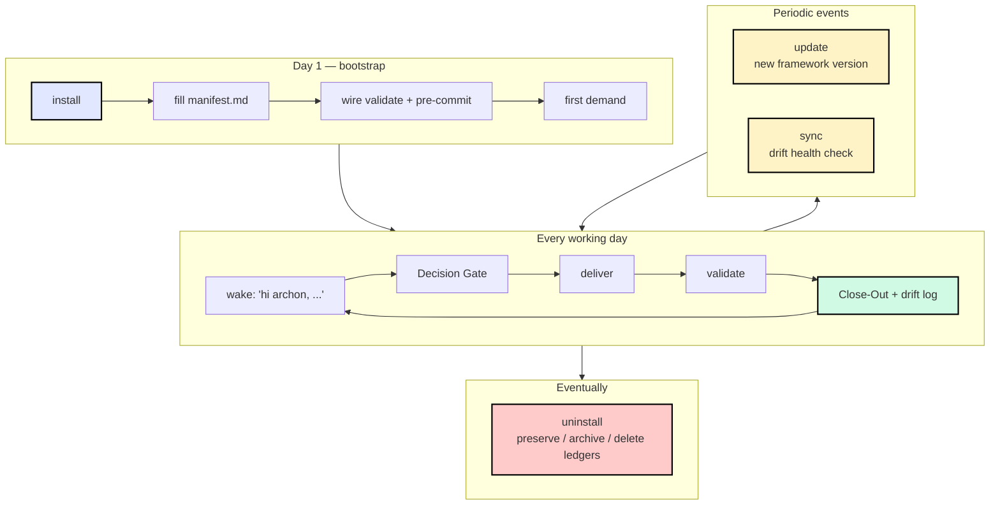
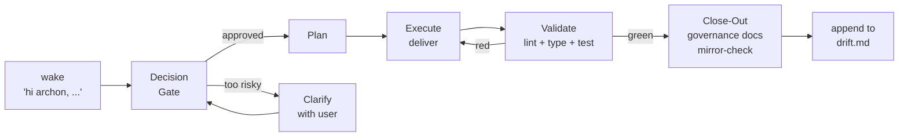

# 完整生命周期

在一个项目里端到端跑 Archon 的完整故事 —— 从「我刚听说这玩意儿」到「我已经用了一年」再到「我要换别的了」。六个阶段，每个都由你日常工作中自然出现的某件事触发。


## 全景图



## 阶段 1 —— Install（一次性，约 3 分钟）

**触发**：在一个全新或既有项目里第一次配置 Archon。

**你本地的代理还没听说过 Archon，所以提示词里必须包含 URL** —— 这是代理拉到协议的唯一通道：

**你说**：`read aaep.site/skill.md and install archon`
&nbsp;·&nbsp; 或者，Node ≥ 18 时：`npx @archon/cli@latest install`

> 在 Cursor、Claude Code、OpenAI Codex CLI、Continue、Aider、Windsurf 以及任何带 web-fetch + write 工具的代理上行为完全一致。协议会自动检测你的 IDE 并把绑定写到正确的目录（`.cursor/` / `.claude/` / `.codex/` 等）。各平台聊天面板的具体说明见 [Quickstart](/zh/setup/quickstart#step-1-install)。

**代理拉取**：`aaep.site/manifest.json` → 每个框架文件（sha256 校验）→ 写入 `.archon/`、`<binding-root>/`、`scripts/`。

**产物**：
- 写入 80+ 个框架文件（具体数量取决于选择了哪些可选模块）。
- 6 个空的运行时 ledger 被初始化 —— `manifest.md` `drift.md` `debt.md` `memos.md` `signs.md` `decisions.md`。
- `drift.md` 里记录一条本次 install 的日志。

**可逆吗？** 可以 —— 见 [阶段 6：Uninstall](#stage-6-uninstall-eventually)。

→ 完整协议：[/zh/setup/install](/zh/setup/install)

## 阶段 2 —— Boot（一次性，约 5 分钟）

**触发**：install 完成；你想把第一个真正的需求循环跑通并留档。

**三件具体的事**，按顺序：

1. **填 `.archon/manifest.md`** —— Platform paths、Tech Stack、Validation Command。三个小节，约 90 秒。
2. **接通 validate 命令** —— 确认 `npm run validate`（或你的等价命令）在干净 shell 里能跑绿。
3. **装 pre-commit 钩子** —— 用 `python3 scripts/archon-check.py --root .`（仅依赖 Python 标准库，到处都能跑）作为绊线。三种接线方式（Python `pre-commit`、原生 git hook、或 husky）见 [Quickstart Step 4](/zh/setup/quickstart#step-4)。用 `git commit --dry-run` 验证。


**然后跑你的第一个需求**：`hi archon, run a plan for X`。Archon 会端到端走一遍**认知循环**：

```
demand → Decision Gate → plan → deliver → validate → Close-Out → drift log
```

→ 完整走查：[/zh/setup/quickstart](/zh/setup/quickstart)

## 阶段 3 —— 日常认知循环（每个工作 session）

**触发**：任何新功能、bug 修复、重构或一段工作。

**你说**：`hi archon, ...`

> 不再需要 URL —— `archon-wake.mdc`（或对应 Claude Code / Codex / Continue 等的平台等价物）每个 session 都会加载，并识别 `hi archon` 唤醒短语。

**Archon 会走**（每次都走，没有例外）：



**会随时间增长的状态**：

| 文件 | 增长内容 | 何时增长 |
|------|---------|---------|
| `.archon/drift.md` | 每次交付一行 + drift 事件 | 每次 Close-Out |
| `.archon/debt.md` | 进行中的债务条目 | 一次交付被允许「先发后修」时 |
| `.archon/memos.md` | 利益相关者否决 / 横切决策 | Decision Gate 浮现出值得记的内容时 |
| `.archon/signs.md` | 触发器索引的推理胶囊 | 由 auditor 从过往交付中提拔出的模式 |
| `.archon/decisions.md` | ADR | 每次架构决策 |

这五个文件**归你的项目所有**。它们登记在 manifest 的 `runtime_ledger_paths` 下，**未来的 update 永不触碰**。

→ 概念深读：[10 分钟速览](/zh/concepts/overview)
&nbsp;·&nbsp; [架构](/zh/concepts/architecture)

## 阶段 4 —— Update（周期性，约 2 分钟）

**触发**：Archon 发了新版本框架，或者你只是想确认自己在最新版上。

**你说**：`hi archon, update yourself`
&nbsp;·&nbsp; 或者，Node ≥ 18 时：`npx @archon/cli@latest update`

> 不再需要 URL —— 唤醒规则会自动把 `update archon` / `hi archon, update yourself` 路由到 `aaep.site/update.md`。

**代理拉取**：最新 manifest → 构建计划（**ADD** / **UPDATE** / **UNCHANGED** / **REMOVE**）→ 询问可选模块 → 拉取有差异的文件（sha256 校验）→ 把被覆盖的文件备份到 `.archon-backup-<ISO>/` → 写入新版本 → 升 `.archon/VERSION` → 把这次 update 记进 `drift.md`。

**永不触碰的内容** —— manifest 的 `runtime_ledger_paths`：

```
.archon/manifest.md   .archon/drift.md   .archon/debt.md
.archon/memos.md      .archon/signs.md   .archon/decisions.md
.archon/debt/         .archon/drift/     .archon/memos/
.archon/manifest/     .archon/runs/      .archon/dashboard/heartbeats/
.archon/memos-archive/
```

你的治理历史是神圣的。Update 只刷新框架文件。

→ 完整协议：[/zh/setup/update](/zh/setup/update)

## 阶段 5 —— Sync（周期性，约 10 秒）

**触发**：「有没有任何东西从规范漂走了？」—— 只读健康检查。

**你说**：`hi archon, sync yourself` &nbsp;·&nbsp; `is archon healthy?`
&nbsp;·&nbsp; 或者，Node ≥ 18 时：`npx @archon/cli@latest sync`

**代理拉取**：最新 manifest → 走遍每条 Archon 拥有的路径 → 分类：

| 标签 | 含义 |
|-------|---------|
| `ok` | 路径在规范中 AND sha256 匹配 |
| `modified` | 路径在规范中 AND sha256 不同（你改过框架文件） |
| `missing` | 路径在规范中但本地不存在 |
| `extra` | 路径在 Archon 拥有的目录里但不在规范中（定制或陈旧） |
| `ledger` | 列在 `runtime_ledger_paths` 里 —— 归你所有，永不 diff |

**不写任何内容**，除非发现真的值得关注，可选地写一条单行 memo。

→ 完整协议：[/zh/setup/sync](/zh/setup/sync)

## 阶段 6 —— Uninstall（终有一天）{#stage-6-uninstall-eventually}

**触发**：你要离开 Archon，或者在测试一次干净的重装。

**你说**：`hi archon, uninstall yourself`
&nbsp;·&nbsp; 或者，Node ≥ 18 时：`npx @archon/cli@latest uninstall`

**对治理 ledger 的三种明确选择**：

| 模式 | ledger 的下场 | 默认？ |
|------|------------------------|----------|
| **Preserve**（P） | 原地保留在 `.archon/` 下 | ✓ 默认 |
| **Archive**（A） | 移动到 `.archon-history-<ISO>/` 然后从 `.archon/` 移除 | |
| **Delete**（D） | 永久抹除 —— 需要键入 `DELETE` | |

**代理拉取**：manifest → 构建移除集（规范里存在的文件，排除 ledger）→ 做最后一次确认 → 删除文件 → 修剪 Archon 拥有的空目录 → 把 `.archon-uninstall-<ISO>.log` 写到项目根目录。

**manifest 之外的文件永不触碰。** 代理拒绝删除任何无法证明 Archon 拥有的东西。

→ 完整协议：[/zh/setup/uninstall](/zh/setup/uninstall)

## 生命周期命令 {#lifecycle-commands}

速查卡片。每个命令都有「代理提示词形式」和「CLI 形式」两种 —— 它们**功能完全等价**。CLI 是**可选的**，需要 Node ≥ 18；代理路径在任何平台都能用。

| 阶段 | 首次代理提示词（需要 URL） | 装好后代理提示词 | 可选 CLI（Node ≥ 18） | 文档页 |
|-------|-----------------------------------------|----------------------------|---------------------------|------|
| Install | `read aaep.site/skill.md and install archon` | （install 自身已覆盖） | `npx @archon/cli@latest install` | [/zh/setup/install](/zh/setup/install) |
| Update | — | `update archon` &nbsp;·&nbsp; `hi archon, update yourself` | `npx @archon/cli@latest update` | [/zh/setup/update](/zh/setup/update) |
| Sync | — | `sync archon` &nbsp;·&nbsp; `is archon healthy?` | `npx @archon/cli@latest sync` | [/zh/setup/sync](/zh/setup/sync) |
| Uninstall | — | `uninstall archon` | `npx @archon/cli@latest uninstall` | [/zh/setup/uninstall](/zh/setup/uninstall) |

## 为什么这套生命周期天生可逆

上面每个阶段在默认行为上都是**可检查、可回退、ledger 不丢**的：

- Install 是全有或全无 —— 没有半装状态。
- Update 在写之前会先把每个被覆盖的文件备份。
- Sync 不写任何东西（除非你显式要求一条 memo）。
- Uninstall 默认保留你的治理 ledger。
- manifest 是一份透明的 JSON 文件 —— 不是不透明的 tarball。
- 每个拉到的文件在写入前都做 sha256 校验。

你可以像加入时一样轻易离开 Archon。这是刻意的：你无法退出的治理不叫治理，叫锁定。

## 接下来

- 刚装完？[Quickstart Step 2 起](/zh/setup/quickstart#step-2-fill-in-your-project-manifest-90-s)。
- 想了解 manifest 的 schema？[规范 Manifest](/zh/setup/manifest)。
- 想要概念模型？[10 分钟速览](/zh/concepts/overview)。
- 准备 update / sync / uninstall？从侧边栏挑对应页面。
