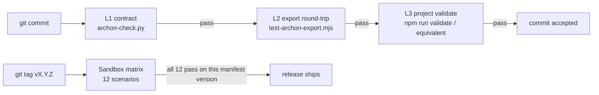

---
title: 测试
outline: deep
---

# 测试

Archon 的设计围绕 **机械化验证，而非散文式约束**。测试面由 **两层互补结构** 组成 —— 发布版本必须两层都通过。

| 层级 | 回答的问题 | 起步入口 |
|-------|------|----------------|
| **沙盒测试 (Sandbox Tests)** | "在这个 IDE × 语言组合下，install / update / sync / uninstall 在一个真实的全新项目里 *是否真的能跑通*？" | [沙盒概览](/zh/testing/sandbox/) |
| **契约测试 (Contract Tests)** | "框架文件之间是否内部一致？包括文件形态、交叉引用、行数上限、禁用子串、声明校验。" | [测试策略](/zh/testing/strategy) |

根据你想回答的问题，选择对应的层级。

## 沙盒测试 —— 端到端是否真的可用？

一套可复现的测试套件：选取四个干净 fixture（Node + TS / Python / Go / Rust）之一，通过四个 IDE 平台（Cursor / Claude Code / Codex CLI / Aider）之一执行某个 Archon 生命周期命令，并将产物目录与固定的预期结果做比对 —— 每次运行的日期、manifest 版本与结果都会被记录下来。

**12 个 scenario** 覆盖了全部 5 个生命周期阶段 × 最常见的 IDE × 语言组合：

- [沙盒概览](/zh/testing/sandbox/) —— 它是什么、为什么存在、最近一次运行摘要。
- [runner 工作原理](/zh/testing/how-runner-works) —— runner 架构、本地/CI 调用方式、agent SDK 适配器契约。
- [测试 fixtures](/zh/testing/sandbox/fixtures) —— 每个 scenario 安装进去的 4 个最小项目。
- [测试矩阵](/zh/testing/sandbox/test-matrix) —— 完整的 12 scenario 网格，逐行附带状态。
- [测试记录模板](/zh/testing/sandbox/template) —— 每个新增 scenario 页面必须遵循的结构。

每个 scenario 页面都会链接一个视频占位文件（`docs/public/videos/`）与一个 asciinema 占位文件（`docs/public/asciinema/`）。当 scenario 进入通过状态后，实际录制内容会被上传。

## 契约测试 —— 文件之间是否内部一致？

每次 commit 都会运行的静态闸门。由三个子层组合成一条 `validate` 链：

| 子层 | 内容 | 位置 |
|-----------|------|-------|
| **L1 —— 可移植治理契约** | 文件形态 · 交叉引用 · 行数上限 · 禁用子串 · Universal Module Guard · Preservation Axis 探针 | `.archon/contracts/governance-contract.yaml`，由 `scripts/archon-check.py`（仅依赖 Python 标准库）与 `scripts/archon-check.sh`（Bash）消费 |
| **L2 —— 导出 manifest 回环** | 每份打包 markdown 引用的图片都必须出现在导出 manifest 中；平台路径改写必须能回环往返 | `scripts/test-archon-export.mjs` |
| **L3 —— 项目 validate 流水线** | 接入方自定义的 lint + typecheck + integration + unit | 接入方自己的测试体系（如 `npm run validate`） |

页面索引：

- [测试策略](/zh/testing/strategy) —— 心智模型、闸门组合、哪些内容 **不会** 被机械化测试覆盖。
- [典型样例](/zh/testing/samples) —— 每个闸门层的带注释示例。
- [如何在你的项目中运行](/zh/testing/how-to-run) —— `archon init` 之后的最小接线方式。

## 两层如何组合



契约测试拦截每一次 commit。沙盒测试拦截每一次 release。两者都必须为绿。

## 30 秒看懂契约测试

```bash
# Layer 1 — portable contract (runs on Python 3 stdlib only)
python3 scripts/archon-check.py --root .

# Layer 2 — export manifest round-trip (only if you ever re-export)
node scripts/test-archon-export.mjs

# Layer 3 — your own project validate pipeline (from manifest.md § Validation Command)
npm run validate    # or python -m pytest, go test, cargo test, etc.
```

`archon doctor` 封装了 Layer 1，并叠加了结构层与 hint 层的检查。详见 [CLI](/zh/setup/cli)。
