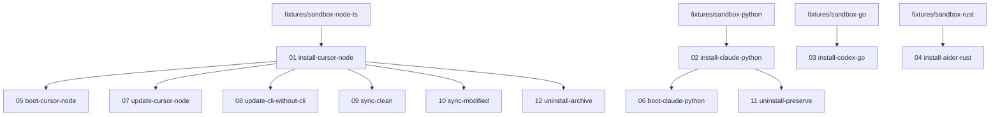

---
title: 测试矩阵
outline: deep
---

# 测试矩阵

sandbox 场景的完整网格。每一行都链接到一个完整的、符合
[`template.md`](./template) 形态的场景页面，包含步骤、
预期结果以及运行记录。

## 网格

| # | test-id | 阶段 | IDE | 语言 | Fixture | 状态 |
|---|---------|:-----:|-----|----------|---------|:------:|
| 01 | [`install-cursor-node`](./scenarios/install-cursor-node) | install | Cursor | Node 20 + TS | sandbox-node-ts | ⏳ |
| 02 | [`install-claude-python`](./scenarios/install-claude-python) | install | Claude Code | Python 3.12 | sandbox-python | ⏳ |
| 03 | [`install-codex-go`](./scenarios/install-codex-go) | install | Codex CLI | Go 1.22 | sandbox-go | ⏳ |
| 04 | [`install-aider-rust`](./scenarios/install-aider-rust) | install | Aider | Rust 1.78 | sandbox-rust | ⏳ |
| 05 | [`boot-cursor-node`](./scenarios/boot-cursor-node) | boot（首次 demand） | Cursor | Node 20 + TS | sandbox-node-ts（在 01 之后） | ⏳ |
| 06 | [`boot-claude-python`](./scenarios/boot-claude-python) | boot（首次 demand） | Claude Code | Python 3.12 | sandbox-python（在 02 之后） | ⏳ |
| 07 | [`update-cursor-node`](./scenarios/update-cursor-node) | update（v0.1.0 → v0.1.1） | Cursor | Node 20 + TS | sandbox-node-ts（在 01 之后） | ⏳ |
| 08 | [`update-cli-without-cli`](./scenarios/update-cli-without-cli) | update 使用 `--without=cli` | Cursor | Node 20 + TS | sandbox-node-ts（在 01 之后） | ⏳ |
| 09 | [`sync-clean`](./scenarios/sync-clean) | sync（预期无 drift） | Cursor | Node 20 + TS | sandbox-node-ts（在 01 之后） | ⏳ |
| 10 | [`sync-modified`](./scenarios/sync-modified) | sync（检测到 drift） | Cursor | Node 20 + TS | sandbox-node-ts（在 01 之后，注入手工编辑） | ⏳ |
| 11 | [`uninstall-preserve`](./scenarios/uninstall-preserve) | uninstall（保留 ledger） | Claude Code | Python 3.12 | sandbox-python（在 02 之后） | ⏳ |
| 12 | [`uninstall-archive`](./scenarios/uninstall-archive) | uninstall（归档 ledger） | Cursor | Node 20 + TS | sandbox-node-ts（在 01 之后） | ⏳ |

> **状态图例**：✅ 通过 · ❌ 失败 · ⏳ 待定。
> 状态**按版本发布**更新：在框架打 tag 之前，每个场景
> 都必须针对候选 manifest 版本通过测试。

## 覆盖率视图

### 按阶段

| 阶段 | 场景数 | Test IDs |
|-------|:-------------:|----------|
| install | 4 | 01–04 |
| boot | 2 | 05, 06 |
| update | 2 | 07, 08 |
| sync | 2 | 09, 10 |
| uninstall | 2 | 11, 12 |
| **总计** | **12** | |

### 按 IDE

| IDE | 场景数 | Test IDs |
|-----|:-------------:|----------|
| Cursor | 7 | 01, 05, 07, 08, 09, 10, 12 |
| Claude Code | 3 | 02, 06, 11 |
| OpenAI Codex CLI | 1 | 03 |
| Aider | 1 | 04 |
| Continue / Windsurf | 0 | （延后 —— 参见 [KNOWN-ISSUES.md](https://github.com/fmw666/archon-protocol/blob/main/KNOWN-ISSUES.md)） |

### 按语言

| 语言 | 场景数 | Test IDs |
|----------|:-------------:|----------|
| Node + TypeScript | 7 | 01, 05, 07, 08, 09, 10, 12 |
| Python | 3 | 02, 06, 11 |
| Go | 1 | 03 |
| Rust | 1 | 04 |

## 依赖关系图

某些场景会复用更早场景安装完成后的状态。
如果你想串联运行，请按以下顺序执行（否则每个场景
都会从 fixture 自行完成准备）：

## 本矩阵**尚未**覆盖的内容

| 缺口 | 延后原因 | 添加触发条件 |
|-----|--------------|----------------|
| Continue / Windsurf IDE 覆盖 | 没有活跃使用者；现在做就是合成测试 | 任一 IDE 出现首位采用者 |
| Java / Kotlin / Swift / C++ fixtures | 参见 [`fixtures/README.md`](https://github.com/fmw666/archon-protocol/blob/main/fixtures/README.md) | 出现首位采用者 |
| `archon doctor` 深度场景 | doctor 是 check + structural 的封装；已通过 09 间接覆盖 | 当其行为与 `sync` 出现差异时 |
| 多 agent / 并行写竞态 | 单 agent 不变量写在 soul.md 中；竞态测试不在范围内 | 当该不变量被放宽时 |
| 跨 OS 矩阵（Linux × macOS × Windows × WSL） | 一方 CI 跑在 Linux；macOS/Windows 通过手工抽查 | 在宣布 `1.0.0` 之前 |

记录这些缺口，是为了让矩阵对当下"sandbox 已测试"
究竟意味着什么保持诚实。
